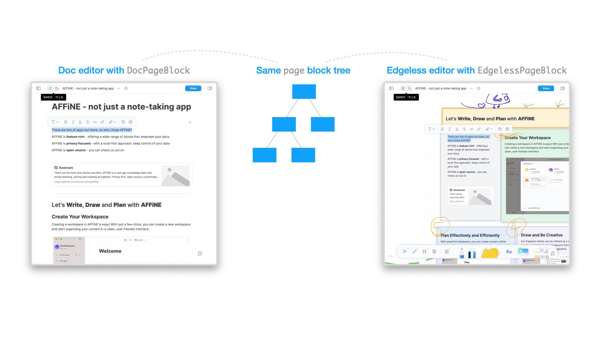

# BlockSuite

  <picture style="width: 500px">
    <source media="(prefers-color-scheme: light)" srcset="https://raw.githubusercontent.com/toeverything/blocksuite/master/assets/logo-and-name-h.svg" />
    <source media="(prefers-color-scheme: dark)" srcset="https://raw.githubusercontent.com/toeverything/blocksuite/master/assets/logo-and-name-h-white.svg" />
    
  </picture>

<!--

-->

---

## Overview

BlockSuite is a toolkit for building collaborative editing applications. It embraces the **_editor-agnostic_** approach to facilitate the development of more flexible, diverse, and scalable editable interfaces.

In developing modern collaborative editing applications, the challenge lies not only in the internal implementation of the editor but also in the complex state management across many UI components. This means that the overall data flow of such applications should be consistently modeled and reused on a larger scale, reducing the interoperability cost between editor and non-editor components. **This is why BlockSuite completely separates the data model of collaborative content from the editor**. This allows any UI component, whether part of an editor or not, to simply **_attach_** to the same block tree document, **_composing_** a more flexible editing experience.

Based on this concept, BlockSuite starts with a foundational block-based document model and independently implements a series of collaborative editing infrastructures, including editors. This means that with BlockSuite, you can choose to:

- Build a new editor from scratch based on the BlockSuite framework.
- Or, reuse a variety of first-party editors based on BlockSuite right out of the box.

The BlockSuite project is structured around key packages, as illustrated in the diagram below:

These packages include:

- An editor-agnostic collaborative editing framework, featuring:
  - `@blocksuite/store`: A data layer for modeling collaborative document states. It is natively built on the CRDT library [Yjs](https://github.com/yjs/yjs), endowing all BlockSuite documents with built-in real-time collaboration and time-travel capabilities.
  - `@blocksuite/inline`: Provides minimal rich text components for basic inline editing capabilities. BlockSuite allows the rich text content in different nodes of the block tree document to be split into many simple inline editors, making complex editable content conveniently composable. **This significantly reduces the complexity required to implement traditional rich text editing features**.
  - `@blocksuite/block-std`: A standard library required for modeling complete UI editable blocks. Its capabilities cover the structure of block fields, events, selection, clipboard support, etc. Note that this package does not directly define UI components for blocks but defines an abstract layer for mapping the block tree to any web framework's component tree.
  - `@blocksuite/lit`: An intermediate layer for adapting the block tree to the [lit](https://lit.dev/) framework component tree UI. It provides base components like `EditorHost` and `BlockElement` for specific block implementations to use. BlockSuite uses lit as the default framework because lit components are native web components, avoiding synchronization issues between the component tree and DOM tree during complex rich text editing.
- A suite of editable components based on this framework, including:
  - `@blocksuite/blocks`: Default block implementations for composing preset editors, including widgets belonging to each block.
  - `@blocksuite/presets`: Plug-and-play editable components categorized into:
    - `EditorPreset` with complete editing functionality, including the `DocEditor` with rich text editing capabilities, and the `EdgelessEditor` with whiteboard editing capabilities.
    - `FragmentPreset` as auxiliary UI components. BlockSuite defines UI components that depend on document status outside of the editor as fragments (such as sidebars, panels, pop-ups, toolbars, etc.). They can have completely different lifecycles from the editor. Preset fragments include `CopilotPanel`, `FramePanel`, `OutlinePanel`, etc., mainly implemented to meet the needs of the [AFFiNE](https://github.com/toeverything/AFFiNE) project.

The above design ensures that BlockSuite is built for scalability. In addition to extending custom blocks, here are what you can also conveniently achieve with BlockSuite:

- Writing type-safe complex editing logic based on the [command](https://blocksuite.io/command.html) mechanism, similar to react hooks designed for document editing, contributing to the maintainability of complex editing applications.
- Persistence of documents and compatibility with various third-party formats (such as markdown and HTML) based on block [snapshots](https://blocksuite.io/data-persistence.html#snapshot-api) and transformer mechanisms. This includes data conversion during import and export, as well as clipboard support.
- Incremental updates, real-time collaboration, local-first state management, and even decentralized data synchronization based on the document's [provider](https://blocksuite.io/data-persistence.html#realtime-provider-based-persistence) mechanism.
- State scheduling across multiple documents and simultaneous use of a single document in multiple editors based on an opt-in workspace mechanism.

> 🚧 BlockSuite is currently in beta, with some extension capabilities still under refinement. Hope you can stay tuned, try it out, or share your feedback!

## Getting Started

To try out BlockSuite, refer to the [Quick Start](https://blocksuite.io/quick-start.html) document and start with the preset editors in `@blocksuite/presets`.

## Resources

- 🎁 Examples
  - [Nightly Playground](https://try-blocksuite.vercel.app/starter/?init)
  - [BlockSuite Monorepo in StackBlitz](https://stackblitz.com/github/toeverything/blocksuite)
  - [Vue-based BlocksVite Editor](https://github.com/zuozijian3720/blocksvite)
- 📝 [Documentation](https://blocksuite.io/quick-start.html)
- 📍 [Good First Issues](https://github.com/toeverything/blocksuite/issues?q=is%3Aopen+is%3Aissue+label%3A%22good+first+issue%22)
- 🎙️ [GitHub Discussions](https://github.com/toeverything/blocksuite/discussions)
- 💬 [Discord Channel](https://discord.gg/9vwSWmYYcZ)
- 🚀 [Releases](https://github.com/toeverything/blocksuite/releases)

## Building

See [BUILDING.md](BUILDING.md) for instructions on how to build BlockSuite from source code.

## Contributing

BlockSuite accepts pull requests on GitHub. **Before you start contributing, please make sure you have read and accepted our [Contributor License Agreement](https://github.com/toeverything/blocksuite/edit/master/.github/CLA.md).** To indicate your agreement, simply edit this file and submit a pull request.

## License

[MPL 2.0](./LICENSE)
