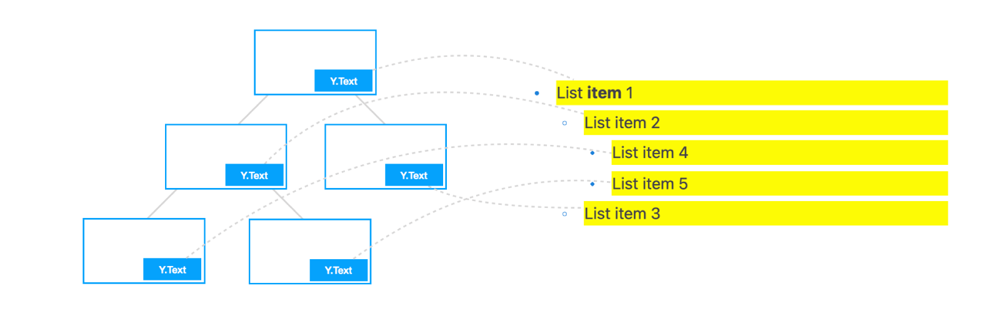
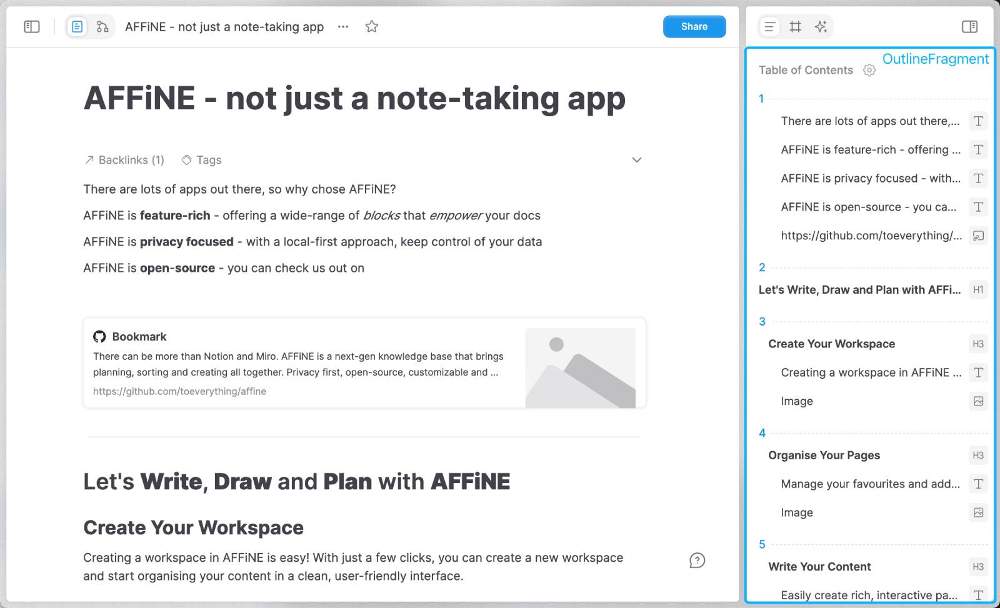

# Building Document-Centric, CRDT-Native Editors

<BlogPostMeta />

## Motivation

For years, web frameworks such as React and Vue have popularized the mental model of component based development. This approach allows us to break down complex front-end applications into components for better composition and maintenance.

Hence, when discussing front-end collaborative editing (or rich text editing), the first thought is often to define an `<Editor/>` component, then design the corresponding data flow and APIs around this editor. This method seems intuitive and has been adopted by many open-source editors in the front-end community. Everything sounds natural, but are there limitations or room for improvement?

In the past years, our team has been dedicated to building a notable open-source knowledge base product ([26k stars on GitHub](https://github.com/toeverything/AFFiNE)). To visualize and organize complex knowledge structures better, we wanted our the editor in our product to be powerful enough, so as to provide an immersive editing and collaboration experience - imagine nesting Google Docs or Notion in an infinite canvas like Figma, as shown below:


However, before finding the best practice, our journey in developing editors was full of challenges. At first glance, the front-end community offers many great rich text editors (like [Slate](https://github.com/ianstormtaylor/slate), [Tiptap](https://tiptap.dev/), [Lexical](https://lexical.dev/)) and whiteboard editors (like [tldraw](https://github.com/tldraw/tldraw)), which usually allows the _embedding_ of React components. Bundling various React-compatible editors together seemed convenient - but proved impractical. To some extent, this is like trying to cram several devices supporting the USB protocol into the same shell. Despite sharing the same interface, there's no guarantee the resulting product will work correctly.

The frustration encountered in directly integrating various open-source editors led us to question the current design philosophy of popular editing frameworks. As a result, we decided to rebuild all necessary infrastructure for our editors, based on recent breakthroughs in collaborative editing technology (specifically, [CRDT](https://en.wikipedia.org/wiki/Conflict-free_replicated_data_type)). The outcome was a powerful design pattern that no longer revolves around the editor. We call this approach _**document-centric**_.

## The Document-Centric Approach

We believe that the current mainstream editing frameworks design their data flow around the `<Editor/>` component, with each editor managing its internal state cohesively. While this is a good design, some issues are hard to resolve:

- The data loading methods and internal state management mechanisms in different editors are not universal, making cross-editor state sharing difficult, often requiring redundant deep copies.
- Different editor containers have distinct internal life cycles, complicating the establishment of a consistent component model.
- The strong binding between document data and editor instances makes sharing a single document across multiple editor instances difficult, or managing multiple documents within a single editor instance.
- Although editors generally support embedding external components, nesting editors can easily lead to conflicts in focus, selection, shortcuts, etc.

Consider a simple example where a text editor A and an image editor B are used together:


For a simple user operation sequence:

- Perform several image editing operations.
- Delete the image, which will usually dispose its UI component.
- Continue editing the text.


If A and B are independently implemented editors, how should the user operation history be managed? Allowing A and B to maintain their history states seems easier, but neither can hold a complete user operation history. When an editor instance is destroyed, the history stack recording user operations generally disappears. Therefore, this often requires bookkeeping outside these editor instances, which is only the beginning of a series of complexities.

Alternatively, in the document-centric model, **we believe that the _document_ - the data layer of the editor, should be maintained completely independent of the editor, allowing the document to persist throughout the application lifecycle**. Thus, no matter if a UI component is part of an editor or not, it should work by simply _**attaching**_ to this document, like this:


Once the document is separated from the editor, it becomes easy to overcome many difficulties under the editor-centric approach:

- The above example is no longer a problem. Since the history record is stored in this persistently existing document, there's no need for bookkeeping between editor instances.
- Cross-editor state sharing can become zero-cost. Because the document (here we are referring to the editable content, not the global DOM variable) is also just a plain JavaScript object, which could be easily shared between different editor instances.
- Since editor instances are no longer strictly bound to document instances, rendering multiple documents in a single editor or displaying a single document across multiple editors becomes intuitively feasible.

In other words, **the document-centric approach aims to establish a data layer that transcends editor boundaries, requiring various editors to drive their updates based on the (whole or partial) state of the external document, thus building a more flexible and diverse experience in a scalable way**.

But given the complexity of collaborative document editing, is such architecture technically feasible?

## Document-Centric and CRDT

Collaborative document editing is known for its complexity. Beyond handling user undo/redo history, traditional real-time collaboration requires complex algorithms like [Operational Transformation](https://en.wikipedia.org/wiki/Operational_transformation) to model editing actions into several restricted operations. Fortunately, CRDTs, which have made breakthrough progress in recent years, can encapsulate this complexity, making the document-centric model possible. **In other words, we believe document-centric needs to be built on the foundation of CRDT**.

Delving into the workings of CRDT is beyond the scope of this article. If you're unfamiliar with CRDT, all you need to know is that when used as a foundational library, CRDTs offer an experience and optimizations akin to standard JavaScript data types, much like the [ImmutableJS](https://immutable-js.com/).

Here's an example using ImmutableJS:

```ts
import Immutable from 'immutable';

let immutableMap = Immutable.Map({ key1: 'value1' });
immutableMap = immutableMap.set('key2', 'value2');

// { key1: 'value1', key2: 'value2' }
console.log(immutableMap.toJSON());
```

And here's an (intuitively symmetrical) example using [Yjs](https://github.com/yjs/yjs), a popular CRDT library:

```ts
import * as Y from 'yjs';

const yMap = new Y.Map();
yMap.set('key1', 'value1');
yMap.set('key2', 'value2');

// Supposed to be { key1: 'value1', key2: 'value2' }
console.log(yMap.toJSON());
```

But be aware, this example won't work as expected! Here `yMap.toJSON()` will return an empty object. Because in Yjs, **you actually need to create a `Y.Doc` first**, then can you use CRDT data types like `Y.Map` / `Y.Array` / `Y.Text`:

```ts
import * as Y from 'yjs';

const yDoc = new Y.Doc();
// You need to `getMap` for top-level fields
const yMap = yDoc.getMap('hello');
yMap.set('key1', 'value1');
yMap.set('key2', 'value2');
// Only then can you attach nested data to doc nodes
yMap.set('key3', new Y.Map());

// { key1: 'value1', key2: 'value2', key3: {} }
console.log(yMap.toJSON());
// { hello: { key1: 'value1', key2: 'value2', key3: {} } }
console.log(yDoc.toJSON());
```

To some extent, **this API design is precisely a representation of the document-centric approach**! Since all state changes are compulsively recorded on one persistently existing `Y.Doc`, it's highly apt for serving as the single source of truth for the state of UI components like editors. Documents based on Yjs have these capabilities:

- They can represent content structures equivalent to JSON, which includes maps, arrays, and various primitive data types in JavaScript.
- Rich text nodes (using `Y.Text` instead of just `string`) can be optionally utilized within the document tree.
- Highly granular event notifications are sent when document tree nodes are updated, potentially replacing the need for a virtual DOM!
- Documents can be serialized into a binary structure akin to [protobuf](https://protobuf.dev/) or RSC payload (see [y-protocols](https://github.com/yjs/y-protocols)), and incremental encoding of partial updates to the document is also possible.
- In collaborative scenarios, these updates can be broadcast directly. Clients don't need to take care about the order of update application to achieve a consistent merged result (as guaranteed by the CRDT algorithm), enabling reliable real-time collaboration among multiple users.

As shown in the following diagram, the entire `Y.Doc` can be encoded into binary updates like the ones depicted, and all subsequent updates such as `yMap.set()` can also be incrementally encoded into the same binary patch:


This mechanism is similar to git. Each `Y.Doc` works like a git repository, and every operation on the CRDT document, such as `yMap.set()`, is akin to performing a `git commit`. This is because, like git, CRDT records all historical operations but without merge conflicts. Naturally, this also makes history management based on CRDT (akin to `git revert`) possible. These capabilities are sufficient for implementing a complete data layer based on CRDT.

Therefore, we chose to implement a common document data layer based on Yjs. This results in the following application data flow:


The blue part owns the full capability to drive UI in complex collaborative applications, including the management of rich text, history, conflict resolution, model update events, etc. This part has a well-defined isolation boundary from UI components and can be used independently of editors. We believe this is the data layer needed for being document-centric.

## The BlockSuite Showcase

Embracing the document-centric philosophy, we created the [BlockSuite](https://github.com/toeverything/blocksuite) project.

In BlockSuite, documents are modeled as `doc` objects. Each doc holds a tree of blocks. Some editor presets can be used upon connecting to a doc as following:

```ts
import { createEmptyDoc, PageEditor } from '@blocksuite/presets';

// Initialize a `doc` document
const doc = createEmptyDoc().init();

// Create an editor, then attach it to the document
const editor = new PageEditor();
editor.doc = doc;

document.body.appendChild(editor);
```

BlockSuite advocates for assembling the top-level `PageEditor` component from smaller editable components, as all editable components can connect to different nodes in the block tree document. For example, instead of using existing complex rich text editors, BlockSuite implemented a `@blocksuite/inline` rich text component that only supports rendering linear text sequences. Complex rich text content can be assembled from atomic inline editor components, as illustrated:


In the diagram, each inline editor instance connects to a `Y.Text` node in the document tree. It models the data format of rich text as a linear sequence, with expressive power equivalent to the [delta](https://quilljs.com/docs/delta/) format. Thus, all rich text content in the document tree can be split into separate inline editors for rendering, **eliminating the nesting between inline editors**. This significantly lowers the cost of implementing rich text features, as depicted:



Since various editors can be loaded and unloaded independently of the document, this allows BlockSuite to support switching between different editors using the same block tree document. Thus, when switching content between document editors and whiteboard editors (which we call `EdgelessEditor`), all operation history recorded on the doc can be preserved, rather than reset:


Moreover, the separation of document and editor also allows docs to be used independently of editors. This is why BlockSuite not only provides various editor UI components but also many peripheral UI components that rely on doc state yet are not part of the editor. We refer to these components as _fragments_. The lifecycle of a fragment can be completely independent of the editor, and it can be implemented with a different technology stack than that used for the editor. For example, the right sidebar in the following diagram belongs to `OutlineFragment`, which facilitates panel arrangement by the application layer (rather than an all-in-one editor):



Furthermore, by supporting a document data layer independent of the editor, we are also able to split traditionally editor-embedded components into independent fragments, thus providing a more unopinionated and reusable `PageEditor`. Areas like the title and doc info panel, intuitively part of the editor's internals, can also become examples of fragments:


Additionally, the document-centric approach aids in better separation between the data layer and rendering layer, enabling developers to break free from the typically DOM-based editors, to implement better performance optimization strategies. For example, the BlockSuite document supports a surface block specially designed for rendering graphic content, which could take the advantage of the HTML5 `<canvas>`. BlockSuite allows these graphic contents to interleave with other block tree contents rendered to the DOM, automatically merging graphic elements into as few canvases as possible to enhance rendering performance:


In contrast, when there are 2000 canvas shapes in the document, tldraw, the DOM-based open-source whiteboard, would reaches its limit. At this point, it exhibits noticeable frame drops during viewport panning and zooming, degrading the content to placeholders with React suspense. However, the canvas renderer in BlockSuite could still maintain a frame rate of over 100fps at this time - and don't forget, you can still use the complete DOM-based rich text editing capability!


A year after creating BlockSuite, we have not only implemented a collaborative editing framework under the document-centric approach but also delivered an editor product with powerful document editing and canvas whiteboard editing capabilities. Considering the time traditionally required to implement complex rich text editors from scratch, we believe this is a highly efficient pattern. Of course, as a young open-source project, BlockSuite still has many areas for continuous improvement, and we hope you could stay tuned!

## Summary

We explored the evolution of collaborative document editors, especially the transitioning from the traditional editor-centric approach to the document-centric approach. This transition implies several key points:

- **Separation of Data and Editor:** We emphasized the importance of separating the document data layer from the editor logic. Through this approach, document data becomes the core of the application, rather than being confined to a specific editor instance. This makes data sharing across editors and history management simple and efficient.
- **Adoption of CRDT:** Withe the help of CRDT, we demonstrated how to efficiently handle complex issues in collaborative editing, such as real-time synchronization and conflict resolution. CRDT provides a scalable way to build powerful multi-user editing experiences while maintaining eventual consistency.
- **Flexible UI Construction:** By separating the document data layer from the editor, we offered greater flexibility in building and optimizing user interfaces. Editors become pluggable components that can be flexibly assembled and configured according to specific application needs, creating richer and more dynamic user experiences.

We believe that the shift to document-centric not only solves some core issues faced by traditional editors but also opens up new possibilities for building future editing experiences. With this new design philosophy, developers can more flexibly build diverse collaborative tools while offering powerful, reliable, and seamless user experiences. As this pattern evolves, we look forward to seeing more innovative collaborative editing solutions emerge.

---

Support our project with a star 🌟 on GitHub: [**toeverything/blocksuite**](https://github.com/toeverything/blocksuite)
