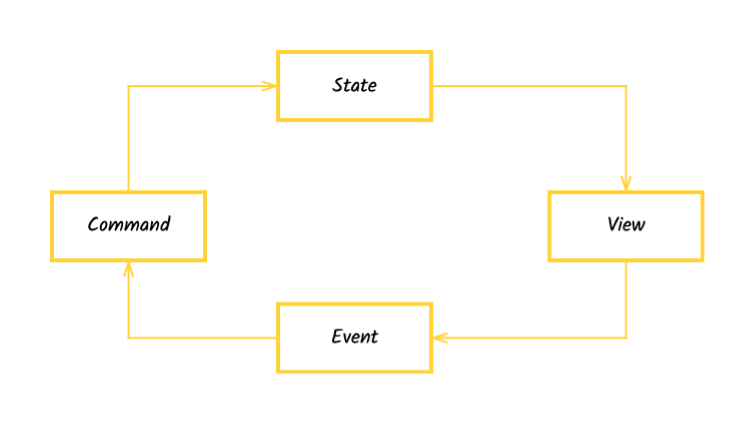

# Block Standard Library

To help you get started with building blocks,
we've created a standard library of blocks that you can use to build your own blocks.
You can install it as `@blocksuite/block-std`.

The block standard library follows a unidirectional data flow.
The editor state is treated as some kind of immutable data structure.

When you want to change the editor state, you should create a command and dispatch it to the editor.
A new editor state will be applied and the UI will be updated accordingly.

Each part of the data flow contains some modules to make sure the system works correctly.
They are:

- **Selection Manager**: a module to manage the selection state. Users can register different types of selections and subscribe to selection changes.
- **Event Dispatcher**: a module to subscribe to events in the editor. Users can update the editor state when the events are triggered.
- **Clipboard Provider**: a module to provide basic abilities for clipboard. Users should build complex clipboard features based on it.
- **View Store**: a module to store the block view tree. Users can find some pieces of information about the view.
- **Spec Store**: a module to store the block specifications. Users can find some pieces of information about the spec.
- **Command Manager**: a module to manage commands. Users can register commands and dispatch them to the editor.
- **🚧 Context Manager**: a module to manage context.

I'll introduce them one by one in the following sections.
