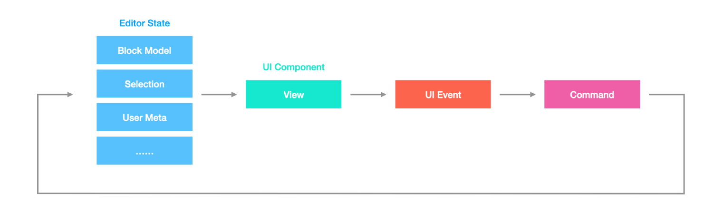

# `block-std` Overview

To help building and reusing block-based editors in BlockSuite, we've created an underlying standard library named `block-std`.

```sh
pnpm i @blocksuite/block-std
```



As an overview, this standard block library follows a [unidirectional data flow](./unidirectional-data-flow). The editor state is treated as some kind of immutable data structure. When you want to change the editor state, you should create a command and dispatch it to the editor. A new editor state will be applied and the UI will be updated accordingly.

Each part of the data flow contains some modules to make sure the system works correctly. They are:

- **Selection Manager**: a module to manage the selection state. You can register different types of selections and subscribe to selection changes.
- **Event Dispatcher**: a module to subscribe to events in the editor. You can update the editor state when the events are triggered.
- **Clipboard Provider**: a module to provide common clipboard capabilities. You can build complex clipboard features based on it.
- **View Store**: a module to store the block view tree. You can find some pieces of information about the view.
- **Spec Store**: a module to store the block specifications. You can find some pieces of information about the spec.
- **Command Manager**: a module to manage commands. You can register commands and dispatch them to the editor.
- **🚧 Context Manager**: a module to manage context.

We'll introduce them in order in the following sections.
