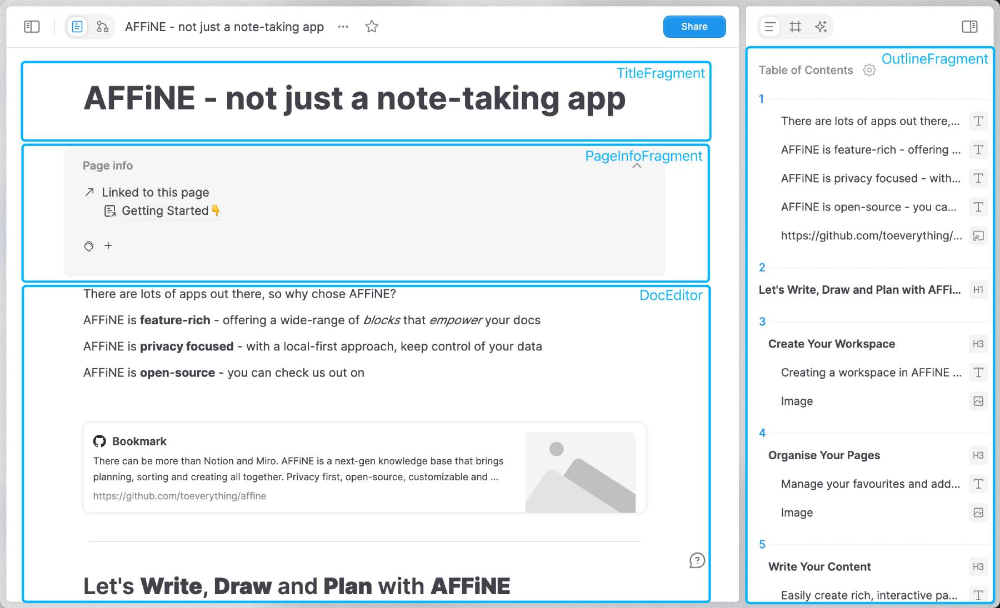

# Component Types

After getting started, this section outlines the foundational editing components in BlockSuite, namely `Editor`, `Fragment`, `Block` and `Widget`.

## Editors and Fragments

The previously mentioned `@blocksuite/presets` includes reusable editors like `DocEditor` and `EdgelessEditor`. Besides these editors, BlockSuite also defines **_fragments_** - UI components that are not editors but are dependent on the document's state. These fragments, such as sidebars, panels, and toolbars, may be independent in lifecycle from the editors, yet should work out-of-the-box when attached to the block tree.

The distinction between editors and fragments lies in their complexity and functionality. **Fragments typically offer more simplified capabilities, serving specific UI purposes, whereas editors provide comprehensive editing capabilities over the block tree**. Nevertheless, both editors and fragments shares similar tech stacks and [data flows](./crdt-native-data-flow).

## Blocks and Widgets

To address the complexity and diversity of editing needs, BlockSuite architects its editors as assemblies of multiple editable blocks, termed [`BlockSpec`](./block-spec-apis)s. Each BlockSpec encapsulates the data schema, view, service, and logic required to compose the editor. These BlockSpecs collectively define the editable components within the editor's environment.

BlockSuite encourages the derivation of various block spec implementations from a single block model to enrich the editing experience. For instance, the root node of the block tree, the page block, is implemented differently for `DocEditor` and `EdgelessEditor` through `DocPageBlockSpec` and `EdgelessPageBlockSpec`, respectively. These serve as the top-level UI components for their respective editors.

Within each block spec, there can be [`Widget`](./block-widgets)s specific to that block's implementation, enhancing interactivity within the editor. BlockSuite leverages this widget mechanism to register dynamic UI components such as drag handles and slash menus within the doc editor.

## Summary

So far, we've explained the interplay between editors, fragments, blocks, and widgets. The next sections will delve into more detailed functionalities of BlockSuite, starting with block tree manipulation.
