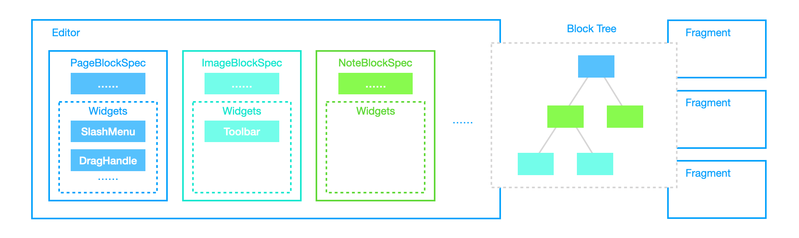
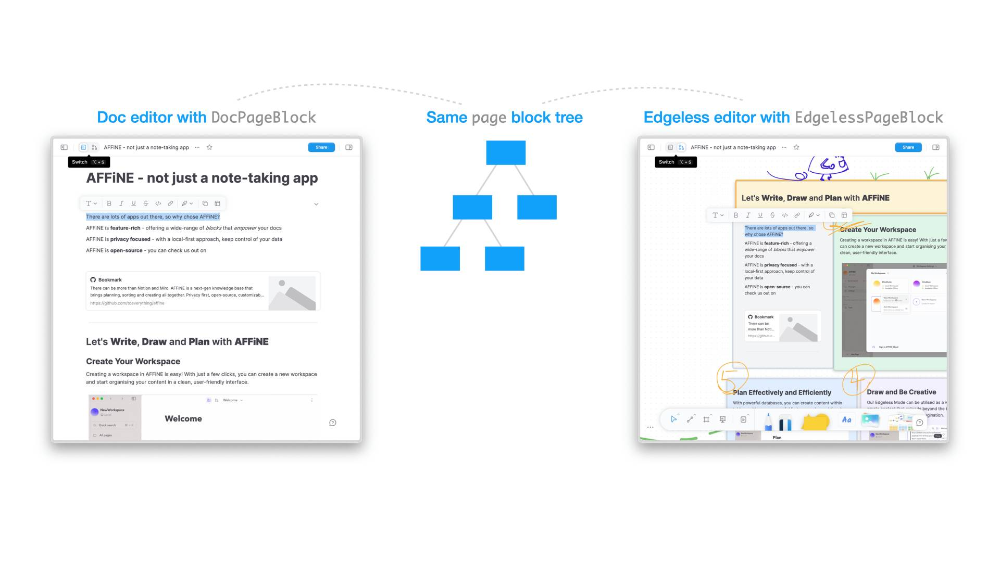

# BlockSuite Component Types

::: info
🌐 This documentation has a [Chinese translation](https://insider.affine.pro/share/af3478a2-9c9c-4d16-864d-bffa1eb10eb6/94-Y53OqW0NFm6l-wqDz6).
:::

After getting started, this section outlines the foundational editing components in BlockSuite, namely `Editor`, `Fragment`, `Block` and `Widget`.

## Editors and Fragments

The `@blocksuite/presets` package includes reusable editors like `DocEditor` and `EdgelessEditor`. Besides these editors, BlockSuite also defines **_fragments_** - UI components that are not editors but are dependent on the document's state. These fragments, such as sidebars, panels, and toolbars, may be independent in lifecycle from the editors, yet should work out-of-the-box when attached to the block tree.

The distinction between editors and fragments lies in their complexity and functionality. **Fragments typically offer more simplified capabilities, serving specific UI purposes, whereas editors provide comprehensive editing capabilities over the block tree**. Nevertheless, both editors and fragments shares similar tech stacks and [data flows](./crdt-native-data-flow).


## Blocks and Widgets

To address the complexity and diversity of editing needs, BlockSuite architects its editors as assemblies of multiple editable blocks, termed [`BlockSpec`](./block-spec)s. Each block spec encapsulates the data schema, view, service, and logic required to compose the editor. These block specs collectively define the editable components within the editor's environment.

Within each block spec, there can be [`Widget`](./block-widgets)s specific to that block's implementation, enhancing interactivity within the editor. BlockSuite leverages this widget mechanism to register dynamic UI components such as drag handles and slash menus within the doc editor.



## Composing Editors by Blocks

In BlockSuite, the `editor` is typically designed to be remarkably lightweight. The actual editable blocks are registered to the [`EditorHost`](/api/@blocksuite/lit/) component, which is a container for mounting block UI components.

BlockSuite by default offers a host based on the [lit](https://lit.dev) framework. For example, this is a conceptually usable BlockSuite editor composed by [`BlockSpec`](./block-spec)s:

```ts
// Default BlockSuite editable blocks
import { DocEditorBlockSpecs } from '@blocksuite/blocks';
// The container for mounting block UI components
import { EditorHost } from '@blocksuite/lit';
// The store for working with block tree
import { type Page } from '@blocksuite/store';

// Standard lit framework primitives
import { html, LitElement } from 'lit';
import { customElement, property } from 'lit/decorators.js';

@customElement('simple-doc-editor')
export class SimpleDocEditor extends LitElement {
  @property({ attribute: false })
  page!: Page;

  override render() {
    return html`
      <editor-host
        .page=${this.page}
        .specs=${DocEditorBlockSpecs}
      ></editor-host>
    `;
  }
}
```

As long as there is a corresponding `host` implementation, you can use the component model of frameworks like react or vue to implement your BlockSuite editors:


Explore the [`DocEditor` source code](https://github.com/toeverything/blocksuite/blob/master/packages/presets/src/editors/doc-editor.ts) to see how this pattern allows composing minimal real-world editors.

## One Block, Multiple Specs

BlockSuite encourages the derivation of various block spec implementations from a single block model to enrich the editing experience. For instance, the root node of the block tree, the _page block_, is implemented differently for `DocEditor` and `EdgelessEditor` through two different specs **but with the same shared `PageBlockModel`**. The two block specs serve as the top-level UI components for their respective editors:



This allows you to **implement various editors easily on top of the same document**, providing diverse editing experiences and great potentials in customizability.

## Summary

So far, we've explained the interplay between editors, fragments, blocks, and widgets. The next sections will delve into more detailed functionalities of BlockSuite, starting with block tree manipulation.
