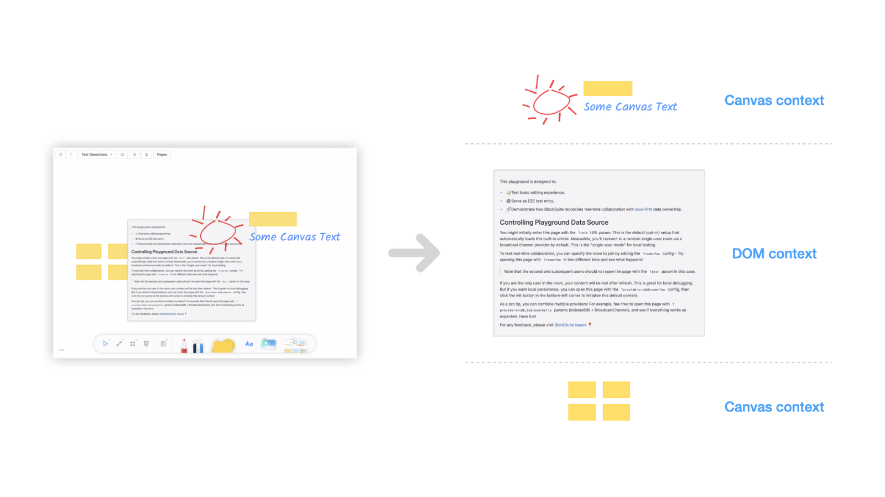

# Surface Block

This is a container used to render graphical content.

- In documents opened with the [edgeless editor](../editors/edgeless-editor), this block is required.
- Its `elements` field can contain a large number of `CanvasElement`s. These elements use HTML5 canvas for rendering and can be interleaved with note blocks, with automatically flattening to use the fewest canvas contexts.

## Reference

- [`SurfaceBlockSchema`](/api/@blocksuite/blocks/variables/SurfaceBlockSchema.html)
- [`SurfaceBlockService`](/api/@blocksuite/blocks/classes/SurfaceBlockService.html)
