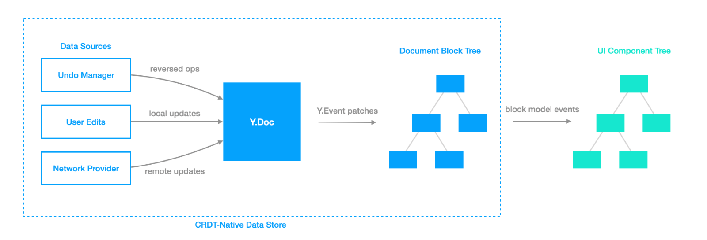

# CRDT-Native Data Flow

To make the editor logic based on BlockSuite intuitive and collaboration-ready, there is one major goal in BlockSuite: **Regardless of whether it is in a multi-user collaboration state, the application-layer code based on BlockSuite should be unaware of it**.

We will introduce how this design is embodied in BlockSuite.

## CRDT as Single Source of Truth

Traditionally, CRDTs have often been seen as a technology specialized in conflict resolution. Many editors initially designed to support single users have implemented support for real-time collaboration by integrating CRDT libraries. To this end, the data models in these editors will be synchronized to the CRDTs. This usually involves two opposite data flows:

- When the local model is updated, the state of the native model is synchronized to the CRDT model.
- When a remote peer is updated, the data resolved from the CRDT model is synchronized back to the native model.

Although this is an intuitive and common practice, it requires synchronization between two heterogeneous models, resulting in a bidirectional data flow. The main issues here are:

- This bidirectional binding is not that easy to implement reliably and requires non-trivial modifications.
- Application-layer code often needs to distinguish whether an update comes from a remote source, which increases complexity.

As an alternative, BlockSuite chooses to directly use the CRDT model as the single source of truth (since BlockSuite uses [Yjs](https://github.com/yjs/yjs), we also call it _YModel_ here). This means that regardless of whether the update comes from local or remote sources, the same process will be performed:

1. Firstly modify YModel, triggering the corresponding [`Y.Event`](https://docs.yjs.dev/api/y.event) that contains all incremental state changes in this update.
2. Update the model nodes in the block tree based on the `Y.Event`.
3. Send corresponding slot events after updating the block model, so as to update UI components accordingly.

This design can be represented by the following diagram:

The advantage of this approach is that the application-layer code can **completely ignore whether updates to the block model come from local editing, history stack, or collaboration with other users**. Just subscribing to model update events is adequate.

::: info
In BlockSuite, we generally refer to the block instances that users manipulate through the `page` API as _block models_, but the true source of the state of these models comes from their underlying CRDT data structure, which is usually referred to as _YBlock_ in our documentation.
:::

## Unidirectional Update Flow

Besides the block tree that uses CRDT as its single source of truth, BlockSuite also manages shared states that do not require a history of changes, such as the awareness state of each user's cursor position. Additionally, some user metadata may not be shared among all users.

In BlockSuite, the management of these state types follows a consistent, unidirectional pattern, enabling an intuitive one-way update flow that efficiently translates state changes into visual updates.

The complete state update process in BlockSuite involves several distinct steps, particularly when handling editor-related UI interactions:

1. **UI Event Handling**: View components generate UI events like clicks and drags, initiating corresponding callbacks. In BlockSuite, it is recommended to model and reuse these interactions using commands.
2. **State Manipulation via Commands**: Commands can manipulate the editor state to accomplish UI updates.
3. **State-Driven View Updates**: Upon state changes, slot events are used to notify and update view components accordingly.

This update mechanism is depicted in the diagram above. Concepts such as [command](./command), [view](./block-view) and [event](./event) are further elaborated in other documentation sections for detailed understanding.

## Summary

In summary, by utilizing the CRDT model as the single source of truth, the application layer code can remain agnostic to whether updates originate from local or remote sources. This simplifies synchronization and reduces complexity. This approach enables applications to acquire real-time collaboration capabilities without necessitating intrusive modifications or adaptations, which is a key reason why the BlockSuite editor has been inherently _collaborative_ from day one.
