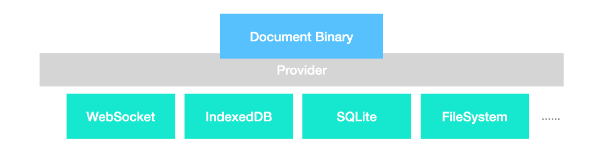

# Data Persistence in BlockSuite

BlockSuite offers flexible solutions for real-time and non-real-time applications. This guide explores optimal ways to utilize data persistence features in BlockSuite.

## Snapshot API

In scenarios where real-time collaboration is not a primary concern, such as in classic cloud-based or local applications requiring explicit save actions, BlockSuite has the JSON snapshot format as the best fit. The snapshot format is designed for readability, organizing blocks in an intuitive tree structure.

```ts
import { Job } from '@blocksuite/store';

// A job is required for performing the tasks
const job = new Job({ workspace });

// Export current page content to snapshot JSON
const json = await job.pageToSnapshot(page);

// Import snapshot JSON to a new page
const newPage = await job.snapshotToPage(json);
```

When it comes to integrating with third-party formats like markdown or HTML, the snapshot API should also be the go-to solution. It allows for adaptive transformations of the block tree (documentation WIP).

::: tip
In BlockSuite [playgroud](https://blocksuite-toeverything.vercel.app/starter/?init), You can try the "Import/Export Snapshot" feature inside the "Test Operations" menu entry. You can also use the `job` variable in browser console for quick testing.
:::

## Realtime Provider-Based Persistence

When it comes to applications requiring real-time collaborative features, BlockSuite recommends a provider-based persistence approach. It involves connecting the document to a provider, such as WebSocket, right from the initialization of the `workspace`. This ensures that **all updates within the editor's lifecycle are encoded as binary patches and distributed via the provider**. This is not only efficient but also ensures real-time, incremental synchronization of document states, offering peak performance for collaborative tasks.



BlockSuite supports a bunch of providers. It allows for the combination of different providers (as seen in [AFFiNE](https://github.com/toeverything/AFFiNE), which for example, uses both `SQLite` and `WebSocket` providers in the electron client) and supports dynamic disconnection and reconnection of providers. Thanks to the inherent properties of CRDTs, BlockSuite guarantees the **eventual consistency** of document states, regardless of the sequence in which patches from various providers are received.

```ts
// IndexedDB provider
import { IndexeddbPersistence } from 'y-indexeddb';

// `workspace.doc` is the underlying Yjs data structure
const { doc } = workspace;
// Connect the doc to the IndexedDB table named `foo`
const provider = new IndexeddbPersistence('foo', doc);

// TODO
```

## Block Tree Initialization Basics

A critical aspect of using BlockSuite effectively is the proper initialization of block trees within a `page`. When operating without a provider, it's recommended to use the snapshot API directly for importing documents:

```ts
// TODO
```

But alternatively, one can also use `page.load(() => { page.addBlock(); /* ... */ })` to build the initial content of a document within the callback of `page.load`:

```ts
// TODO
```

In contrast, when a provider is involved, the application logic must distinguish between creating a new document and loading an existing one. For new documents, the process mirrors that of the non-provider scenario, using `page.load(initCallback)`. For existing documents, the initial state should be awaited using `await page.load()`. In both cases, `page.slots.ready` can be utilized to receive notifications upon the completion of document initialization. This approach was so fundamental to BlockSuite's early design that initial versions exclusively supported provider-based persistence, highlighting its commitment to a local-first architecture. An example code block to demonstrate the loading of a page is provided below.

## Summary

By weaving together these different aspects of data persistence, this document aims to provide a coherent guide on how to effectively utilize BlockSuite's capabilities. Whether for real-time collaboration or more traditional application structures, these practices ensure that users can leverage the full potential of BlockSuite for data management.
