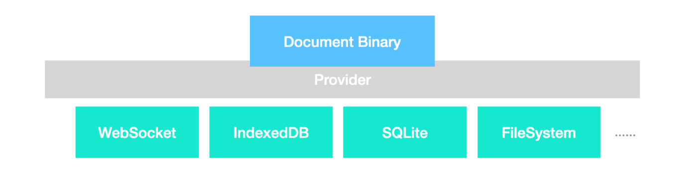

# Data Persistence

In the `SimpleAffineEditor` example, we did not actually use the data persistence capability of BlockSuite. This means that the blocks created by the user will disappear after the page is refreshed. How can we store these contents to a server or local database?

BlockSuite uses CRDT data model that is very similar to Git. This means that when you call methods like `page.addBlock`, this is equivalent to synchronously committing to Git (all block operation APIs in BlockSuite are synchronous, which brings a very convenient and reliable development experience). And thanks to the capability of CRDT, it can efficiently serialize the entire block state sequence into binary.

::: tip
The BlockSuite workspace is encoded using the [y-protocols](https://github.com/yjs/y-protocols) protocol, which can be thought of as a binary JSON format for collaborative applications. You can enter `Y.encodeStateAsUpdate(workspace.doc)` in the console of the [BlockSuite Playground](https://blocksuite-toeverything.vercel.app/?init) to view the encoded workspace.
:::

However, the more powerful aspect of the Git model is that you only need to connect via SSH or HTTP to sync a Git repository, without worrying about handling asynchronous network IO details. This is why BlockSuite provides a provider-based persistence solution.

## Provider-Based Persistence

Different providers can handle the asynchronous IO over different network protocols (such as WebSocket and WebRTC) and storages (such as IndexedDB and SQLite). As long as the BlockSuite workspace is connected to the provider, you can reliably synchronize blocks through it.



Code example:

```ts
import { Workspace } from '@blocksuite/store';
import { AffineSchemas } from '@blocksuite/blocks/models';
import { IndexeddbPersistence } from 'y-indexeddb';

const workspace = new Workspace();
workspace.register(AffineSchemas);

// `workspace.doc` is the underlying Yjs data structure
const { doc } = workspace;
// Connect the doc to the IndexedDB table named `foo`
const provider = new IndexeddbPersistence('foo', doc);

provider.on('synced', () => {
  console.log('content from the database is loaded');
});
```

The content in this workspace will be automatically synchronized to an IndexedDB table named `foo`. Now you can add a button to the page and execute the following code when it is clicked:

```ts
const page = workspace.createPage();
page.addBlock('affine:page', { title: new Text('hello') });
```

The document data will be automatically synchronized to IndexedDB. After the next refresh, the content of `affine:page` should appear directly on the page. If you want to use a WebSocket connection, you can achieve the same persistence effect with very similar code logic by switching or using providers simultaneously. As BlockSuite leverages Yjs as its underlying data structure, you can reuse the [Connection Providers](https://docs.yjs.dev/ecosystem/connection-provider) or the [Database Providers providers](https://docs.yjs.dev/ecosystem/database-provider) from the Yjs ecosystem.

::: tip

- The BlockSuite workspace is **always empty when created**, and the source of block update is either by calling the API to create blocks or by receiving updates from the provider.
- Multiple providers can be reliably connected at the same time, just as it is easy to add multiple remote upstreams for a git repository.
  :::

You can view more provider usage instructions in the [BlockSuite Playground](https://blocksuite-toeverything.vercel.app/?init).

The persistence we are introducing now only involves the internal CRDT data format used by BlockSuite. Importing and exporting to different document formats will be covered when introducing the editor.

## Reusing Binary Data

The `workspace.doc` in BlockSuite is encoded in binary format before being stored in the provider backend. This binary data structure can also be deserialized to reconstruct the document state. This process can also be easily accomplished through standardized APIs.

::: info

🚧 WIP

:::
