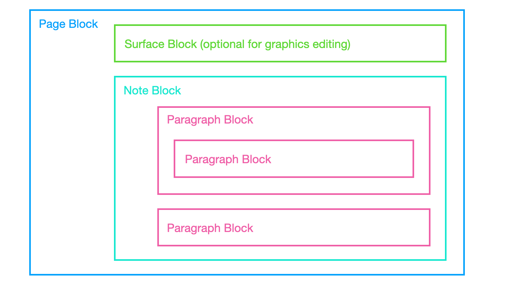

# Flavoured Blocks

In BlockSuite, block is the basic unit of structured content, representing a piece of text, an image or other media elements, or even a nested sub-document. BlockSuite supports defining various types of blocks, referred to as **flavoured blocks**. By combining and nesting blocks, users can create richly structured content.

The term "[flavour](<https://en.wikipedia.org/wiki/Flavour_(particle_physics)>)" for blocks is inspired by the concept in physics and its value follows the `namespace:name` format. For example, we allow an `affine:paragraph` block to have similar sub-types, such as `h1`, `h2`, `h3`, `quote`, etc., which reduces redundant code and makes it easier for blocks with similar behavior to be converted between each other.

::: info
In general, the terms "block flavour" and "block type" can be used interchangeably.
:::

## Basic Block Operation APIs

In BlockSuite, the basic APIs for managing blocks include `addBlock`, `updateBlock`, and `deleteBlock`. These operations allow users to create, modify, and remove blocks within a `page`, providing an easy way to manage and organize the structured content.

The `page.addBlock` method takes one required `flavour` argument. This argument marks the type of block to be added. Optionally, you can use the `props` argument that contains the properties for the new block, the `parent` and `parentIndex` arguments to specify the parent block and the index at which the new block should be inserted, respectively.

Example usage:

```ts
import { Text } from '@blocksuite/store';

const props = { title: new Text('My New Page') };
const newBlockId = page.addBlock('affine:page', props);
```

`page.addBlock` returns the auto-generated `id` of the added block, rather than the block instance. The block instance will be added synchronously to the page, and can be retrieved by calling `page.getBlockById(id)`. To access any block on the page's block tree, simply reference it using `page.root.children[0].children[1]`.

Each block instance on a page is a plain JavaScript model, representing a node on the block tree. At a minimum, each block node contains three fields:

- `id` for the unique identifier of the block.
- `flavour` for the block type.
- `children` for any child blocks.

Note that a paragraph block can also nest another paragraph block using the `children` field without an intermediate level.

::: info
These is a good reason behind the design that returns `id` rather than block instance for `addBlock`, which is the key to make the APIs collaborative by default (documentation WIP).
:::

The `page.updateBlock` method is used to modify the properties of an existing block. It takes two arguments: the block instance to be updated and an object containing the updated properties.

Example usage:

```ts
const props = { text: new Text('New paragraph') };
page.updateBlock(block, props);
```

Similarly, you can use the `page.deleteBlock` method to remove a block from the block tree.

::: tip
In [BlockSuite playground](https://blocksuite-toeverything.vercel.app/?init), you can run `workspace.doc.toJSON()` in the console to see the basic block structure in BlockSuite.
:::

## Block Flavours

In the prebuilt editor, creating a simple page requires following block flavours: [`affine:page`](https://github.com/toeverything/blocksuite/tree/master/packages/blocks/src/page-block), [`affine:frame`](https://github.com/toeverything/blocksuite/tree/master/packages/blocks/src/frame-block), and [`affine:paragraph`](https://github.com/toeverything/blocksuite/tree/master/packages/blocks/src/paragraph-block).

- The `affine:page` block serves as the top-level container for a page, holding all other blocks within the page hierarchy.
- The `affine:frame` block acts as a flat container within the page, and multiple frames can be positioned on the whiteboard.
- Each `affine:paragraph` block holds a linear sequence of rich text within the page. It enables users to create text-based content and style it according to their needs.



::: tip
In AFFiNE, the `affine:frame` block is crucial for blending the document mode with the whiteboard mode. In document mode, the frame acts as a transparent container that doesn't affect the display of its internal blocks. However, in whiteboard mode, the frame has absolute positioning, allowing its content to be freely placed on the canvas.
:::

There are more block flavours available in the prebuilt editor, including:

- [`affine:code`](https://github.com/toeverything/blocksuite/tree/master/packages/blocks/src/code-block)
- [`affine:database`](https://github.com/toeverything/blocksuite/tree/master/packages/blocks/src/database-block)
- [`affine:divider`](https://github.com/toeverything/blocksuite/tree/master/packages/blocks/src/divider-block)
- [`affine:embed`](https://github.com/toeverything/blocksuite/tree/master/packages/blocks/src/embed-block)
- [`affine:list`](https://github.com/toeverything/blocksuite/tree/master/packages/blocks/src/list-block)
- [`affine:surface`](https://github.com/toeverything/blocksuite/tree/master/packages/blocks/src/surface-block)

## Block Roles

In BlockSuite, the blocks can be also be categorized into two distinct roles:

1. `HubBlock` serves as an empty block container, which include `affine:page`, `affine:frame` and `affine:database`.
2. `ContentBlock` contains atomic content, this includes `affine:paragraph`, `affine:list`, `affine:code` and `affine:embed`.

`HubBlock` acts as container that affects the presentation of the blocks it contains. For example, a frame block can be positioned absolutely on a whiteboard, while a database block can display each of its child blocks as separate rows or group them further into boards. In contrast, `ContentBlock` can only nest other `ContentBlock` to express structures like nested markdown lists.

## Defining Block Schema

::: info
This section is subject to change in future updates.
:::

To define a new block, you need to define and register its schema, which describes the shape of the block. This can be done declaratively using the `defineBlockSchema` API:

```ts
import { defineBlockSchema } from '@blocksuite/store';

type ListType = 'bulleted' | 'numbered' | 'todo';

const ListBlockSchema = defineBlockSchema({
  flavour: 'affine:list',
  // The `Text` here is used for defining built-in rich text type
  props: ({ Text }) => ({
    // Supports strongly typed enums
    type: 'bulleted' as ListType,
    // Rich text content that supports inline formats
    text: Text(),
    // A boolean property with default value
    checked: false,
  }),
  metadata: {
    // Used for data validation and migration
    version: 1,
    // 'content' | 'hub'
    role: 'content',
  },
});
```

In this example, `props` defines the fields on each block instance, while `metadata` contains singleton metadata specific to this block flavour. After registering the block flavour to the workspace, you can operate on it using `page` APIs:

```ts
workspace.register([ListBlockSchema]);
const page = workspace.createPage();

const id = page.addBlock('affine:list');
const listBlock = page.getBlockById(id);

// Convert the list type
page.updateBlock(listBlock, { type: 'numbered' });
```

So far, we have only covered the definition of the block model using the `@blocksuite/store` package, which is framework agnostic. In the following sections, we will explain how to integrate the block model with UI frameworks, as well as how to build your own editable block in AFFiNE, which involves additional runtime concepts.
