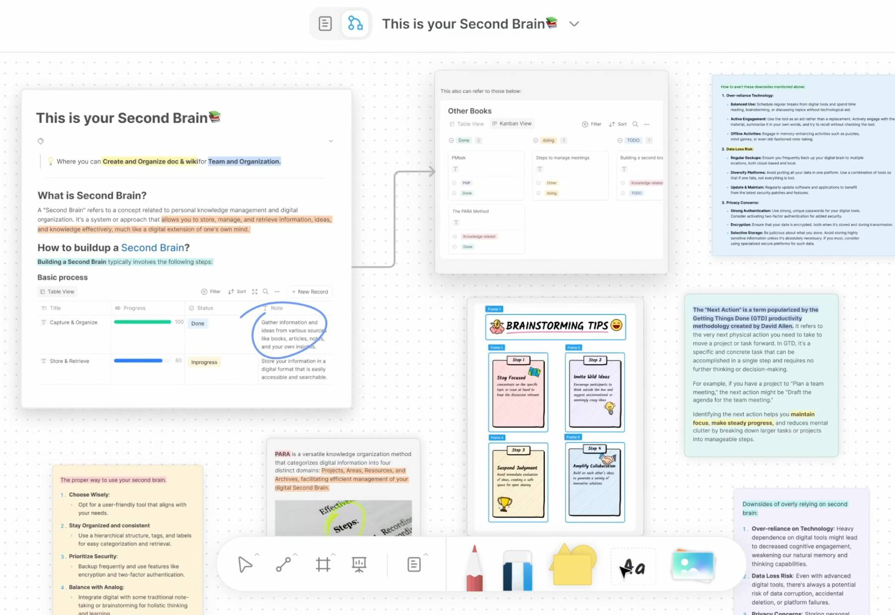

# BlockSuite Framework Overview

> _People who are really serious about editor should make their own framework._

---

BlockSuite is a toolkit for building editors and collaborative applications. It implements a series of content editing infrastructures, UI components and editors independently.

You can consider BlockSuite as a [UI component library](../components/overview) for building various editors, based on a minimized vanilla framework as their runtime. With BlockSuite, you can:

- Reuse multiple first-party BlockSuite editors:
  - [**`PageEditor`**](../components/editors/page-editor): A comprehensive block-based document editor, offering extensive customization and flexibility.
  - [**`EdgelessEditor`**](../components/editors/edgeless-editor): A graphics editor with opt-in canvas rendering support, but also shares the same rich-text capabilities with the `PageEditor`.
- Customize, extend and enhance these editors with a rich set of [BlockSuite components](../components/overview) and [examples](https://github.com/toeverything/blocksuite/tree/master/examples). All BlockSuite components (including editors) are native web components, making them framework-agnostic and easy to interop with popular frameworks.
- Or, build new editors from scratch based on the underlying vallina framework.

> 🚧 BlockSuite is currently in its early stage, with components and extension capabilities still under refinement. Hope you can stay tuned, try it out, or share your feedback!

## Motivation

BlockSuite originated from the [AFFiNE](https://github.com/toeverything/AFFiNE) knowledge base, with design goals including:

- **Support for Multimodal Editable Content**: When considering knowledge as a single source of truth, building its various view modes (e.g., text, slides, mind maps, tables) still requires multiple incompatible frameworks. Ideally, no matter how the presentation of content changes, there should be a consistent framework that helps.
- **Organizing and Visualizing Complex Knowledge**: Existing editors generally focus on editing single documents, but often fall short in dealing with complex structures involving intertwined references. This requires the framework to natively manage state across multiple documents.
- **Collaboration-Ready**: Real-time collaboration is often seen as an optional plugin, but in reality, we could natively use the underlying CRDT technology for editor state management, which helps to build a [clearer and more reliable data flow](../blog/crdt-native-data-flow).

During the development of AFFiNE, it became clear that BlockSuite was advancing beyond merely being an in-house editor and evolving into a versatile framework. That's why we chose to open source and maintain BlockSuite independently.

<!-- ## Examples -->

## Features

With BlockSuite editors, you can selectively reuse all the editing features in [AFFiNE](https://affine.pro/):

And under the hood, the vanilla BlockSuite framework supports:

- Defining [custom blocks](./working-with-block-tree#defining-new-blocks) and inline embeds.
- Incremental updates, [real-time collaboration](https://github.com/toeverything/blocksuite/blob/master/BUILDING.md#test-collaboration), and even decentralized data synchronization based on the [document streaming](./data-synchronization#document-streaming) mechanism.
- Writing type-safe complex editing logic based on the [command](./command) mechanism, similar to react hooks designed for document editing.
- Persistence of documents and compatibility with various third-party formats (such as markdown and HTML) based on block [snapshot](./data-synchronization#snapshot-api) and transformer.
- State scheduling across multiple documents and reusing one document in multiple editors.

To try out BlockSuite, refer to the [quick start](./quick-start) example and start with the preset editors in `@blocksuite/presets`.

## Architecture

The relationship between BlockSuite and AFFiNE is similar to that between the [Monaco Editor](https://github.com/microsoft/monaco-editor) and [VSCode](https://code.visualstudio.com/), but with one major difference: BlockSuite is not automatically generated based on the AFFiNE codebase, but is maintained independently with a different tech stack — AFFiNE uses React while BlockSuite uses [web components](https://developer.mozilla.org/en-US/docs/Web/API/Web_components).

This difference has led BlockSuite to set clear boundaries between packages, ensuring:

- Both AFFiNE and other projects should equally reuse and extend BlockSuite through components, without any privileges.
- BlockSuite components can be easily reused regardless of whether you are using React or other frameworks.

To that end, the BlockSuite project is structured around key packages that are categorized into two groups: a headless [framework](https://github.com/toeverything/blocksuite/tree/master/packages/framework) and prebuilt editing components.

<table>
  <thead>
    <tr>
      <th colspan="2">Framework</th>
    </tr>
  </thead>
  <tbody>
    <tr>
      <td><code>@blocksuite/store</code></td>
      <td>Data layer for modeling collaborative document states. It is natively built on the CRDT library <a href="https://github.com/yjs/yjs">Yjs</a>, powering all BlockSuite documents with built-in real-time collaboration and time-travel capabilities.</td>
    </tr>
    <tr>
      <td><code>@blocksuite/inline</code></td>
      <td>Minimal rich text components for inline editing. BlockSuite allows spliting rich text content in different block nodes into different inline editors, making complex content conveniently composable. <strong>This significantly reduces the complexity required to implement traditional rich text editing features.</strong></td>
    </tr>
    <tr>
      <td><code>@blocksuite/block-std</code></td>
      <td>Framework-agnostic library for modeling editable blocks. Its capabilities cover the structure of block fields, events, selection, clipboard support, etc.</td>
    </tr>
  </tbody>
</table>

<table>
  <thead>
    <tr>
      <th colspan="2">Components</th>
    </tr>
  </thead>
  <tbody>
    <tr>
      <td><code>@blocksuite/blocks</code></td>
      <td>Default block implementations for composing preset editors, including widgets belonging to each block.</td>
    </tr>
    <tr>
      <td><code>@blocksuite/presets</code></td>
      <td>Plug-and-play editable components including <i>editors</i> (<code>PageEditor</code> / <code>EdgelessEditor</code>) and auxiliary UI components named <i>fragments</i> (<code>CopilotPanel</code>, <code>DocTitle</code>...).</td>
    </tr>
  </tbody>
</table>
