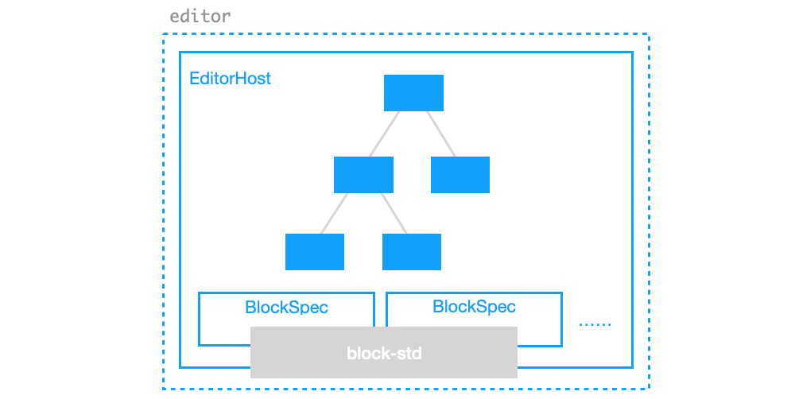
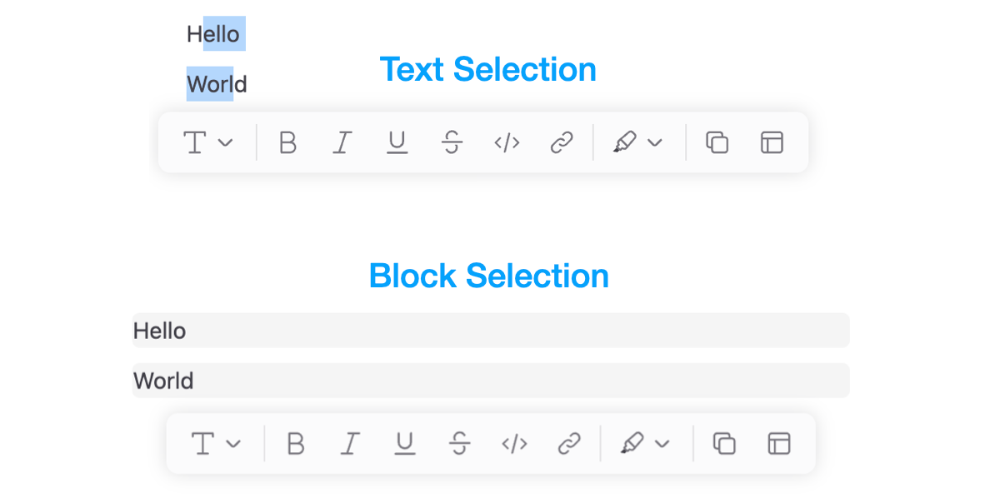
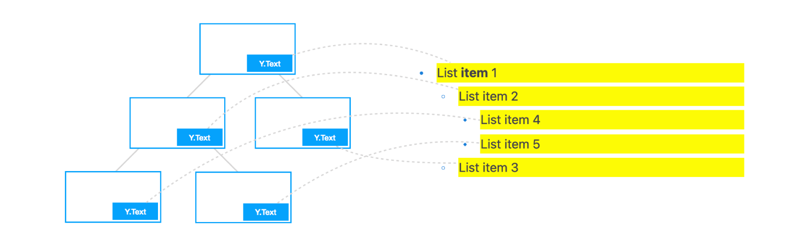
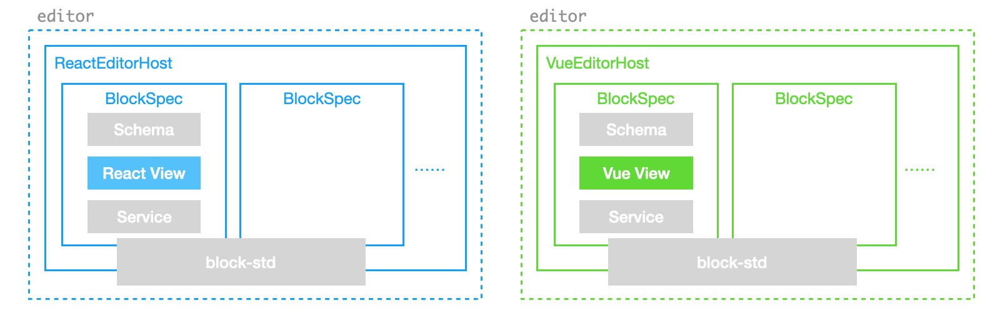

# Working with Block Tree

::: info
🌐 This documentation has a [Chinese translation](https://insider.affine.pro/share/af3478a2-9c9c-4d16-864d-bffa1eb10eb6/-3bEQPBoOEkNH13ULW9Ed).
:::

In previous examples, we demonstrated how a `doc` collaborates with an `editor`. In this document, we will introduce the basic structure of the block tree within the `doc` and the common methods for controlling it in an editor environment.

## Block Tree Basics

In BlockSuite, each `doc` object manages an independent block tree composed of various types of blocks. These blocks can be defined through the [`BlockSchema`](./block-schema.md), which specifies their fields and permissible nesting relationships among different block types. Each block type has a unique `block.flavour`, following a `namespace:name` naming structure. Since the preset editors in BlockSuite are derived from the [AFFiNE](https://github.com/toeverything/AFFiNE) project, the default editable blocks use the `affine` prefix.

To manipulate blocks, you can utilize several primary APIs under `doc`:

- [`doc.addBlock`](/api/@blocksuite/store/classes/Doc.html#addblock)
- [`doc.updateBlock`](/api/@blocksuite/store/classes/Doc.html#updateblock)
- [`doc.deleteBlock`](/api/@blocksuite/store/classes/Doc.html#deleteblock)
- [`doc.getBlockById`](/api/@blocksuite/store/classes/Doc.html#getblockbyid)

Here is an example demonstrating the manipulation of the block tree through these APIs:

```ts
// The first block will be added as root
const rootId = doc.addBlock('affine:page');

// Insert second block as a child of the root with empty props
const props = {};
const noteId = doc.addBlock('affine:note', props, rootId);

// You can also provide an optional `parentIndex`
const paragraphId = doc.addBlock('affine:paragraph', props, noteId, 0);

const modelA = doc.root!.children[0].children[0];
const modelB = doc.getBlockById(paragraphId);
console.log(modelA === modelB); // true

// Update the paragraph type to 'h1'
doc.updateBlock(modelA, { type: 'h1' });

doc.deleteBlock(modelA);
```

This example creates a subset of the block tree hierarchy defaultly used in `@blocksuite/presets`, illustrated as follows:


In BlockSuite, you need to initialize a valid document structure before attaching it to editors, which is also why it requires `init()` after `createEmptyDoc()`.

::: info
The block tree hierarchy is specific to the preset editors. At the framework level, `@blocksuite/store` does **NOT** treat the "first-party" `affine:*` blocks with any special way. Feel free to add blocks from different namespaces for the block tree!
:::

All block operations on `doc` are automatically recorded and can be reversed using [`doc.undo()`](/api/@blocksuite/store/classes/Doc.html#undo) and [`doc.redo()`](/api/@blocksuite/store/classes/Doc.html#redo). By default, operations within a certain period are automatically merged into a single record. However, you can explicitly add a history record during operations by inserting [`doc.captureSync()`](/api/@blocksuite/store/classes/Doc.html#capturesync) between block operations:

```ts
const rootId = doc.addBlock('affine:page');
const noteId = doc.addBlock('affine:note', props, rootId);

// Capture a history record now
doc.captureSync();

// ...
```

This is particularly useful when adding multiple blocks at once but wishing to undo them individually.

## Block Tree in Editor

To understand the common operations on the block tree in an editor environment, it's helpful to grasp the basic design of the editor. This can start with the following code snippet:

```ts
const { host } = editor;
const { spec, selection, command } = host.std;
```

Firstly, let's explain the newly introduced `host` and `std`, which are determined by the framework-agnostic architecture of BlockSuite:

- As [mentioned before](./component-types#composing-editors-by-blocks), the `editor.host` - also known as the [`EditorHost`](/api/@blocksuite/block-std/) component, is a container for mounting block UI components. It handles the heavy lifting involved in mapping the **block tree** to the **component tree**.
- Regardless of the framework used to implement `EditorHost`, they can access the same headless standard library designed for editable blocks through `host.std`. For example, `std.spec` contains all the registered [`BlockSpec`](./block-spec)s.

::: tip
We usually access `host.spec` instead of `host.std.spec` to simplify the code.
:::

As the runtime for the block tree, this is the mental model inside the `editor`:



## Selecting Blocks

The essence of editor lies in allowing users to **dynamically select and modify** the data. In BlockSuite, you can use the `SelectionManager`, which is responsible for managing selections, through `std.selection` or `host.selection`. As an example, after selecting some blocks in the editor, you can execute the following code snippets line by line in the console:

```ts
// Get current selection state
const cached = selection.value;

// Clear current selection state
selection.clear();

// Recover the selection state from cache
selection.set(cached);

// Try setting only part of the selection
selection.set([cached[0]]);
```

In `block-std`, BlockSuite implements several atomic selection types for `SelectionManager`, such as `TextSelection` and `BlockSelection`. The content currently selected by the user is automatically divided into these primitive selection data structures, recorded in the list returned by `selection.value`. Through `selection.set()`, you can also programmatically control the current selection state of the editor.

This allows the selection manager to handle different types of selections, as shown in the following illustration, using the same API:



In `selection.value`, different types of selection states can coexist simultaneously. Each selection object records at least the `id` and `path` of the corresponding selected block (i.e., the sequence of ids of all blocks from the root block to that block). Moreover, you can further categorize different types of selections using the `group` field. For example in `PageEditor`, both `TextSelection` and `BlockSelection` belong to the `note` group. Hence, the example structure of block selection in the above image is as follows:

```ts
[
  {
    type: 'block',
    group: 'note',
    path: ['root_id', 'note_id', 'paragraph_1_id'],
  },
  {
    type: 'block',
    group: 'note',
    path: ['root_id', 'note_id', 'paragraph_2_id'],
  },
];
```

For the more complex native [selection](https://developer.mozilla.org/en-US/docs/Web/API/Selection), the `TextSelection` can be used to model it. It marks the start and end positions of the native selection in the block through the `from` and `to` fields, recording only the `index` and `length` of the inline text sequence in the respective block. This simplification is made possible by the architecture of BlockSuite, where editable blocks use `@blocksuite/inline` as the rich text editing component. Each block tree node's rich text content is rendered independently into different inline editors, eliminating nesting between rich text instances:



Additionally, the entire `selection.value` object is isolated under the `clientId` scope of the current session. During collaborative editing, selection instances between different clients will be distributed in real-time (via [providers](./data-synchronization#document-streaming)), facilitating the implementation of UI states like remote cursors.

For more advanced usage and details, please refer to the [`Selection`](./selection) documentation.

## Service and Commands

In many cases, operations on the block tree within an editor environment need further encapsulation. For example, when using the selection manager mentioned before, since the atomic selection state only includes `id`s, retrieving the corresponding block model based on `selection.value` often requires some boilerplate, as follows:

```ts
function getFirstSelectedModel(host: EditorHost) {
  const { selection, doc } = host;
  const firstSelection = selection.value[0];
  const { path } = firstSelection;
  const leafId = path[path.length - 1];
  const blockModel = doc.getBlockById(leafId);
  return blockModel;
}
```

This direct usage is not very convenient. Also, as BlockSuite encourages completely splitting the editor into different [`BlockSpec`](./block-spec)s ([recall here](./component-types#composing-editors-by-blocks)), which indicates that methods and properties globally available in the editor should also be implemented on the block level. A mechanism is needed at this point to organize such code, ensuring maintainability in large projects. This is why BlockSuite introduces the concept of [`BlockService`](./block-service).

### Service

In BlockSuite, service is used for registering state or methods specific to a certain block type. For example, instead of implementing the `getFirstSelectedModel` method yourself, you can use shortcuts predefined on `RootService`:

```ts
const rootService = host.spec.getService('affine:page');

// Get models of selected blocks
rootService.selectedModel;
// Get UI components of selected blocks
rootService.selectedBlocks;
```

Here, `getService` is used to obtain the service corresponding to a certain block spec. Each service is a plain class, existing as a singleton throughout the lifecycle of the `host` (with a corresponding [`mounted`](/api/@blocksuite/block-std/classes/BlockService.html#mounted) lifecycle hook). Some typical uses of service include:

- For blocks that serve as the root node of the block tree, common editor APIs can be registered on their services for application developers.
- For blocks requiring specific dynamic configurations, service can be used to pass in corresponding options. For example, a service can accept configurations related to image uploading for image block.
- For blocks that need to execute certain side effects (such as subscribing to keyboard shortcuts) when the editor loads, operations on `host` can be done in the `mounted` callback of their services. In this way, even if the block does not yet exist in the block tree, the corresponding logic will still execute.

As an example, the following code more specifically shows how the two getters `selectedBlocks` and `selectedModels` mentioned earlier are implemented using a service:

```ts
import { BlockService } from '@blocksuite/block-std';
import type { BlockComponent } from '@blocksuite/lit';
import type { RootBlockModel } from './root-model.js';

export class RootService extends BlockService<RootBlockModel> {
  // ...

  // A plain getter in service
  get selectedBlocks() {
    let result: BlockComponent[] = [];
    // Here we are using something new...
    // Introducing commands!
    this.std.command
      .chain()
      .tryAll(chain => [
        chain.getTextSelection(),
        chain.getImageSelections(),
        chain.getBlockSelections(),
      ])
      .getSelectedBlocks()
      .inline(({ selectedBlocks }) => {
        if (!selectedBlocks) return;
        result = selectedBlocks;
      })
      .run();
    return result;
  }

  // Another plain getter
  get selectedModels() {
    return this.selectedBlocks.map(block => block.model);
  }
}
```

### Commands

Besides the service, this code snippet also utilizes the chain of commands occurring on `this.std.command` (the [`CommandManager`](/api/@blocksuite/block-std/classes/CommandManager)). This is about using predefined [`Command`](./command)s.

In BlockSuite, you can always control the editor solely through direct operations on `host` and `doc`. However, in the real world, it's often necessary to treat some operations as variables, dynamically constructing control flow (e.g., dynamically combining different subsequent processing logics based on current selection states). This is where commands really shines. **It allows complex sequences of operations to be recorded as reusable chains, and also simplifies the context sharing between operations**.

The code at the end of the previous section demonstrates the basic usage of commands:

- The `pipe` method is used to start a new command chain.
- The `tryAll` method sequentially executes multiple sub-commands on the current chain's context.
- Commands like `getSelectedBlock` and `getTextSelection` are used for actual block tree operations.
- The `inline` method transfers the state on the command context object to the outside or executes other side effects.
- The `run` method is used to finally execute the command chain. The context will be destroyed after the command chain execution.

In the above methods, task-specific commands like `getSelectedBlock` are not implemented by the command manager but are registered by individual blocks. In fact, since BlockSuite separates the framework-specific `host` from the framework-agnostic `block-std`.

You can refer to the [`Command`](./command) documentation for more advanced uses of commands.

::: info
We plan to continue supplementing and documenting some of the most commonly used commands, please stay tuned.
:::

## Defining New Blocks

So far, we have introduced almost all the main parts that make up a block spec. Now, it's time to learn how to create new block types.

In BlockSuite, the block spec is built from three main components: [`schema`](./block-schema), [`service`](./block-service), and [`view`](./block-view). Among these, the definition of the `view` part is specific to the frontend framework used. For example, in the case of `PageEditor` and `EdgelessEditor` based on `@blocksuite/lit`, the block specs are defined with lit primitives in this way:

```ts
import type { BlockSpec } from '@blocksuite/block-std';
import { literal } from 'lit/static-html.js';

const MyBlockSpec: BlockSpec = {
  schema: MyBlockSchema, // Define this with `defineBlockSchema`
  service: MyBlockService, // Extend `BlockService`
  // Define lit components here
  view: {
    component: literal`my-block-component`,
    widgets: {
      myToolbar: literal`my-toolbar`,
      myMenu: literal`my-menu`,
    },
  },
};
```

This design aims at balancing ease of use with customizability. Both the service and view are built around the schema, which allows for different components, services, and widgets to be implemented for the same block model, enabling:

- A single block to have multiple component views. For example, `PageEditor` and `EdgelessEditor` have different implementations of the root block ([recall here](./component-types#one-block-multiple-specs)).
- A single block to be configured with different widget combinations. For instance, you can remove all widgets to compose read-only editors.
- A single block to even be implemented based on different frontend frameworks, by simply providing an `EditorHost` middleware implementation for the respective framework.



::: info

- In terms of cross-framework support, the biggest difference between BlockSuite and other popular editor frameworks is that **BlockSuite has no DOM host of its own**. Instead, it implements a middleware like `@blocksuite/lit`, mapping the block tree to the framework's component tree. Thus, the entire content area of a BlockSuite editor is natively controlled by different frameworks, rather than creating many different framework component subtrees within a BlockSuite-controlled DOM tree through excessive use of `createRoot`.
- The reason BlockSuite uses lit by default is that as a web component framework, the lit component tree IS the DOM tree natively. This simplifies the three-phase update process of `block tree -> component tree -> DOM tree` to just `block tree -> component (DOM) tree`.
  :::

Furthermore, BlockSuite also supports defining the most commonly used type of custom block in a more straightforward way: the _embed block_. **This type of block does not nest other blocks and manages its internal area's state entirely on its own**. For example, to create a GitHub link card that can be displayed in `PageEditor`, you can start by defining the model:

```ts
import { BlockModel } from '@blocksuite/store';
import { defineEmbedModel } from '@blocksuite/blocks';

// Define strongly typed block model
export class EmbedGithubModel extends defineEmbedModel<{
  owner: string;
  repo: string;
}>(BlockModel) {}
```

Then based on this model, a lit-based UI component for the block can be defined:

```ts
import { EmbedBlockComponent } from '@blocksuite/blocks';
import type { EmbedGithubBlockModel } from './embed-github-model.js';
import { html } from 'lit';
import { customElement } from 'lit/decorators.js';

@customElement('affine-embed-github-block')
export class EmbedGithubBlock extends EmbedBlockComponent<EmbedGithubModel> {
  // styles...

  override render() {
    return this.renderEmbed(() => {
      return html`
        <div class="affine-embed-github-block">
          <h3>GitHub Card</h3>
          <div>${this.model.owner}/${this.model.repo}</div>
        </div>
      `;
    });
  }
}
```

As next step, we can further define the corresponding `BlockSpec`:

```ts
import { createEmbedBlock } from '@blocksuite/blocks';
import { EmbedGithubBlockModel } from './embed-github-model.js';

export const EmbedGithubBlockSpec = createEmbedBlock({
  schema: {
    name: 'github',
    version: 1,
    toModel: () => new EmbedGithubModel(),
    props: () => ({
      owner: '',
      repo: '',
    }),
  },
  view: {
    component: literal`affine-embed-github-block`,
  },
});
```

Finally, by inserting this `BlockSpec` into the `host.specs` array, you can expand with new block types:

```ts
// ...
import { PageEditorBlockSpecs } from '@blocksuite/blocks';
import { EmbedGithubBlockSpec } from './embed-block-spec.js';

const editor = new PageEditor();
editor.specs = [...PageEditorBlockSpecs, EmbedGithubBlockSpec];
editor.doc = doc;
```

After completing the above steps, you can insert the new block type into the block tree:

```ts
const props = {
  owner: 'toeverything', // The company behind BlockSuite and AFFiNE 🤫
  repo: 'https://github.com/toeverything/blocksuite',
};

// The 'affine' prefix is kept by default, but you can also override it.
doc.addBlock('affine:embed-github', props, parentId);
```

You can view the [source code](https://github.com/toeverything/blocksuite/tree/master/packages/blocks/src/embed-github-block) for the above example in BlockSuite repository.

Combining the earlier example of composing `PageEditor` entirely based on block spec ([recall here](./component-types#composing-editors-by-blocks)), this should give you a more direct understanding of BlockSuite's extensibility.
