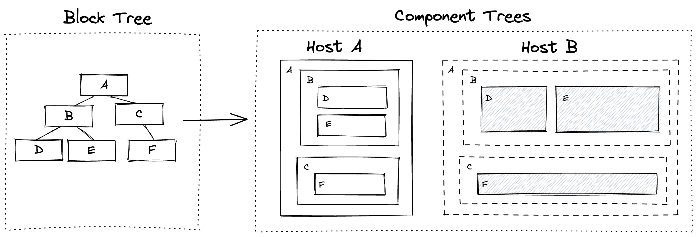

# Host-Based Portability

::: info
🚧 The implementation of this section is still under development and may be subject to change.
:::

Although the BlockSuite project was created for the AFFiNE product, it does not mean that BlockSuite only offers one opinionated editor. On the contrary, due to the strong emphasis on the all-in-one editing experience in AFFiNE, BlockSuite needs to support editing the same document structure in multiple presentation forms. This includes seamlessly switching between document mode and whiteboard mode. To achieve this, instead of implementing a monolithic editor, the principle in BlockSuite is to:

1. Implement a generic semantic block tree data structure. Each block is a piece of atomic content that is not tied to layout.
2. Implement multiple UI environments, called _hosts_, for rendering the block tree. When switching editing modes, simply switch the same block tree to a different host instance.

This means that the block tree of a page can be rendered in different forms in multiple hosts:

Currently, when switching between document mode and whiteboard mode in AFFiNE, the corresponding page instance is reused, and only the UI component tree based on Lit will be re-mounted. This is a typical multi-host implementation. The `EditorContainer` is actually just a lightweight entry wrapper for switching between the two hosts.

This approach has many benefits, such as:

- Providing editability for the block tree on demand. For example, in read-only mode and on the server-side, a streamlined host can be implemented.
- Allowing singleton UIs (such as selection boxes, context menus, and toolbars) in different hosts to have independent implementations. For example, in a mobile device-oriented editor, the editing interaction of an image block may be completely different from that in a desktop editor.
- By implementing nested hosts, deep integration between multiple page data sources can be achieved. For example in a single page, it is possible to insert content from external pages. Note that in this case, one external page need to be loaded into an independent and asynchronously importable host.

Furthermore, the multiple `contenteditable` design of BlockSuite is just an implementation in the default BlockSuite host. Hosts based on other frameworks do not necessarily need to implement cross-block editing in this way.

Since the first-party hosts in BlockSuite are still evolving rapidly, we are currently unable to provide more detailed documentation on how to implement hosts. However, we believe that providing multiple hosts for a single block tree will allow for a more flexible structured editing user experience and a more concise code architecture. We will prove this point by providing more production-ready hosts in BlockSuite.
