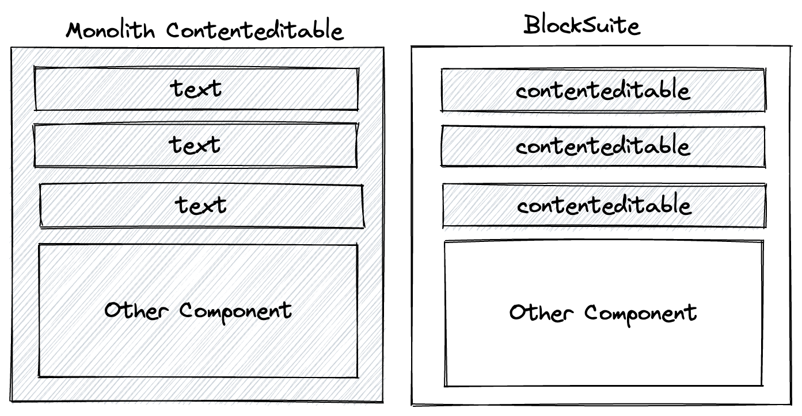
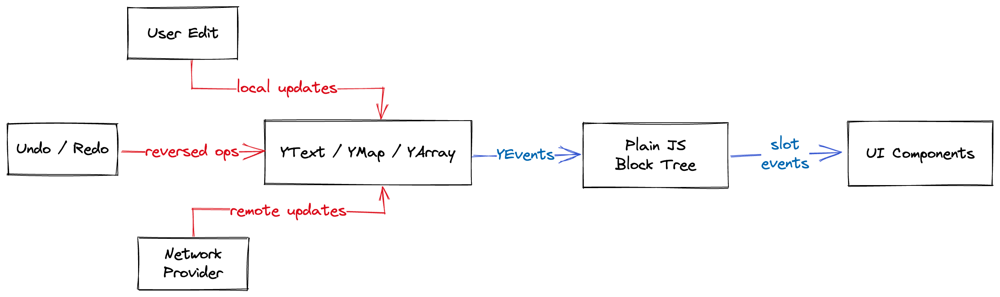

# Introduction

BlockSuite (_pronounced "block sweet"_ 🍬) is a comprehensive project that aims to provide a progressive solution for building collaborative applications. It includes a block-based framework for composing rich content editors, as well as an out-of-the-box block editor tailored for the [AFFiNE](https://github.com/toeverything/AFFiNE) knowledge base. The core concept behind BlockSuite is block-based editing, where text editing and state management are all handled on a block-by-block basis. This is facilitated by using CRDT technology for distributed collaboration. Additionally, BlockSuite supports framework-agnostic rendering to ensure scalability and flexibility.

## Block-Based Editing

In traditional rich text editors, all content resides within a single `contenteditable` DOM element. This approach presents numerous compatibility challenges and can be difficult to integrate with modern UI frameworks.

BlockSuite introduces a new paradigm for rich text editing known as block-based editing. Its block-based architecture overcomes these challenges by managing a block tree in its store. Each block node within this tree can be rendered using any common frontend framework. **If multiple blocks contain rich text, they are rendered across multiple `contenteditable` instances**, providing better stability and compatibility.

For example, in a BlockSuite document containing two paragraphs, an image, and a table with ten text cells, you can have 12 rich text editor instances coexisting. The image component can be implemented using any regular UI framework without needing to be placed within a `contenteditable` element. This design allows for seamless integration and interaction between various components, while maintaining compatibility and stability across different UI frameworks.

To further enhance block-based editing functionality, BlockSuite has also developed its own lightweight rich text editing component called _[Virgo](https://github.com/toeverything/blocksuite/tree/master/packages/virgo)_. It's a web component designed to function like an input box for flat rich text content, rather than a heavy rich text container. This significantly reduces redundancy, allowing for stable rich text editing capability to be achieved with minimal code. In practice, you can use any UI framework to build collaborative editors by embedding Virgo and reusing the BlockSuite data store.

Block-based editing enables the use of popular UI frameworks for rendering nested block content while avoiding the instability often associated with `contenteditable` elements.

## CRDT-Driven State Management

The block-based editing architecture of BlockSuite may appear simple, but in reality, it requires advanced [CRDT](https://en.wikipedia.org/wiki/Conflict-free_replicated_data_type) (Conflict-free Replicated Data Types) technology to make it possible. This is because state changes in complex document editing scenarios often occur across multiple blocks. Coordinating state changes among numerous rich text instances can be challenging, especially when it comes to tracing historical states.

However, CRDT is well-suited to address these issues. BlockSuite's block tree is built upon the high-performance [Yjs](https://github.com/yjs/yjs) library, which automatically records and tracks all historical operations on data (down to individual characters) while providing user-friendly APIs similar to `Map` and `Array`. With CRDT as its single source of truth, BlockSuite's block update API is not only straightforward to use, but also forms the [unidirectional data flow](./unidirectional-data-flow) that is collaborative by design.

Also, thanks to the capability of CRDT to serialize any local state updates into incremental and standardized data structures, the following benefits are achieved:

- Fully incremental undo and redo, enabling zero-cost time travel at runtime.
- Incremental distribution of update data over the network, with updates being distributable via pluggable providers over different network protocol layers.
- Serialization of the entire application state into standardized data formats, allowing for reading and writing with compatible [Rust implementations](https://github.com/y-crdt/y-crdt) outside the browser.

The CRDT-based state management capabilities in BlockSuite are a prerequisite for building local-first applications, which leads to significant improvements in developer experience and user experience. To support the AFFiNE project, the accompanying [OctoBase](https://github.com/toeverything/OctoBase) project has been developed together with BlockSuite, providing underlying pluggable persistence and data synchronization support for local-first collaborative applications.

By leveraging CRDT-driven state management, BlockSuite offers a powerful solution for handling complex content editing and the development of local-first application.

## Framework Agnostic Rendering

Based on the CRDT-native architecture design, BlockSuite can effectively separate the data layer from the UI layer. This allows BlockSuite to achieve two further objectives:

- The assembly of complex collaborative applications using any UI framework.
- The easy embedding of the entire collaborative editor into other applications.

This is demonstrated in two ways:

- The block tree in BlockSuite provides a subscription-based API, allowing it to be used as a state store with different frontend frameworks. This provides a development experience similar to using popular state management libraries.
- The AFFiNE Editor, included with BlockSuite, uses [Web Components](https://developer.mozilla.org/en-US/docs/Web/Web_Components) to build its foundational block components. This means that not only can any frontend framework be used to develop blocks within AFFiNE, but the editor can also be embedded as a standardized web component in any framework.

However, the rendering capabilities in BlockSuite are not limited to the DOM. For example, to support the whiteboard feature in AFFiNE, BlockSuite has implemented the _Phasor_ rendering library. This library enables the rendering of the CRDT model onto a canvas and allows it to share historical state with the main document.

To summarize, BlockSuite offers excellent flexibility in rendering. It allows for seamless integration with various UI frameworks and provides easy embedding of the collaborative editor into other applications.
