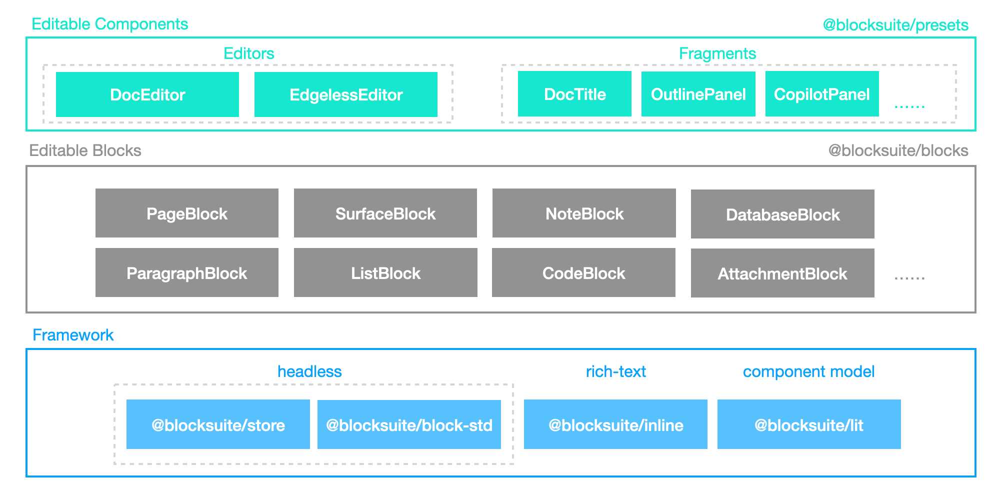

# BlockSuite Overview

BlockSuite is a toolkit for building collaborative editing applications. It embraces the **_document-centric_** approach to facilitate the development of more flexible, diverse, and scalable editable interfaces.

We believe that for modern collaborative editing applications, the overall application data flow should be consistently modeled and reused on a larger scale, reducing the interoperability cost between editor and non-editor components. **Hence, BlockSuite completely separates the collaborative document model from the editor**. This separation allows any UI component, whether part of an editor or not, to function effectively by simply attaching it to the same document, offering a more flexible editing experience.

<!--
> For an understanding of the design philosophy advocated by BlockSuite, please read the _Document-Centric, CRDT-Native_ article.
-->

Based on this concept, BlockSuite starts with a foundational block-based document model and independently implements a series of collaborative editing infrastructures, including editors. This means that with BlockSuite, you can choose to:

- Build new editors from the ground up based on the BlockSuite framework.
- Or, reuse multiple first-party BlockSuite editors right out of the box:
  - [**`DocEditor`**](./presets/doc-editor): **Built entirely from scratch**, `DocEditor` is a comprehensive block-based document editor, offering extensive customization and flexibility.
  - [**`EdgelessEditor`**](./presets/edgeless-editor): **Featuring canvas-based graphics rendering** at its core with sophisticated rich-text features, `EdgelessEditor` offers unique functionalities and decent performance in whiteboard editing.

The BlockSuite project is structured around key packages that are categorized into two groups: a headless framework and prebuilt editing components.

<table>
  <tr>
    <th colspan="2">Headless Framework</th>
  </tr>
  <tr>
    <td><code>@blocksuite/store</code></td>
    <td>Data layer for modeling collaborative document states. It is natively built on the CRDT library <a href="https://github.com/yjs/yjs">Yjs</a>, powering all BlockSuite documents with built-in real-time collaboration and time-travel capabilities.</td>
  </tr>
  <tr>
    <td><code>@blocksuite/inline</code></td>
    <td>Minimal rich text components for inline editing. BlockSuite allows spliting rich text content in different block nodes into different inline editors, making complex content conveniently composable. <strong>This significantly reduces the complexity required to implement traditional rich text editing features.</strong></td>
  </tr>
  <tr>
    <td><code>@blocksuite/block-std</code></td>
    <td>Framework-agnostic library for modeling editable blocks. Its capabilities cover the structure of block fields, events, selection, clipboard support, etc.</td>
  </tr>
  <tr>
    <td><code>@blocksuite/lit</code></td>
    <td>Intermediate layer for adapting the block tree to the <a href="https://lit.dev/">lit</a> framework component tree UI. BlockSuite uses lit as the default framework because lit components are native web components, avoiding synchronization issues between the component tree and DOM tree during complex editing.</td>
  </tr>
</table>

<table>
  <tr>
    <th colspan="2">Prebuilt Components</th>
  </tr>
  <tr>
    <td><code>@blocksuite/blocks</code></td>
    <td>Default block implementations for composing preset editors, including widgets belonging to each block.</td>
  </tr>
  <tr>
    <td><code>@blocksuite/presets</code></td>
    <td>Plug-and-play editable components including <i>editors</i> (<code>DocEditor</code> / <code>EdgelessEditor</code>) and auxiliary UI components named <i>fragments</i> (<code>CopilotPanel</code>, <code>DocTitle</code>...).</td>
  </tr>
</table>

This can be illustrated as the diagram below:

In addition to extending custom blocks, here are what you can also conveniently achieve with BlockSuite:

- Writing type-safe complex editing logic based on the [command](./command) mechanism, similar to react hooks designed for document editing.
- Persistence of documents and compatibility with various third-party formats (such as markdown and HTML) based on block [snapshot](./data-persistence#snapshot-api) and transformer.
- Incremental updates, real-time collaboration, local-first state management, and even decentralized data synchronization based on the document's [provider](./data-persistence#provider-based-state-management) mechanism.
- State scheduling across multiple documents and reusing one document in multiple editors.

To try out BlockSuite, refer to the [Quick Start](./quick-start) document and start with the preset editors in `@blocksuite/presets`.

> 🚧 BlockSuite is currently in its early stage, with some extension capabilities still under refinement. Hope you can stay tuned, try it out, or share your feedback!
