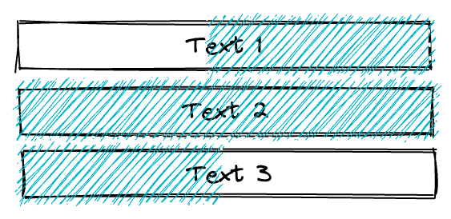

# Rich Text Orchestration

In typical web applications, it is usually unnecessary to address the native drag-select highlight state as a type of user input. However, in the case of rich content editors, these states are essential. That's why BlockSuite not only offers the Virgo rich text component but also establishes a corresponding cross-block selection state processing mechanism on the host. This enables users to engage in intuitive editing.

Below we will introduce how BlockSuite models complex structures of rich text documents.

## Flat Rich Text Data Structure

In BlockSuite, all blocks can accommodate nested child nodes without using redundant group containers. As a result, a multi-level indented list can be represented as nested list blocks in a straightforward manner.

However, when it comes to nesting rich text content within rich text content, a multitude of edge cases can arise that are challenging to handle due to compatibility issues with browsers. For this reason, the BlockSuite host will independently render all rich text data types on the block tree into distinct Virgo rich text components:


::: info

- In BlockSuite, the `Text` data type utilized for modeling rich text is distinct from the standard JavaScript `string`. While both can support collaborative modifications, the rich text type allows for character-level merging, whereas the new values of the string type will overwrite each other entirely.
- In BlockSuite, block nesting is not entirely unrestricted. For instance, the hub block in AFFiNE cannot be arbitrarily nested inside other hub blocks. The precise rules should be established by product requirements and can be configured declaratively via the schema.

:::

By doing so, each rich text instance only requires fundamental style information, such as bold, italic, and underline, resulting in a flat data structure. BlockSuite adopts the [`Delta`](https://quilljs.com/docs/delta/) format for modeling rich text. For instance, consider the following rich text content:


It will be expressed as the following delta sequence:

```ts
const delta = [
  { insert: 'hello ' },
  { insert: 'Block', attributes: { bold: true } },
  { insert: 'Suite', attributes: { bold: true, italic: true } },
];
```

This delta structure is present in the CRDT and can be displayed as a separate `contenteditable` element through Virgo. This is how BlockSuite models rich text content.

::: info
The delta format was initially conceived and implemented by the [Quill](https://quilljs.com/) editor. In the [initial BlockSuite prototype](https://github.com/toeverything/blocksuite/commit/d66b566203f8ef33591a0eaf3b3b28b2a3c22b14), Quill was employed to render rich text content. However, the block-based architecture of BlockSuite significantly decreases the complexity of the rich text component. As a result, we could seamlessly replace the Quill subset used in BlockSuite with Virgo in subsequent iterations, leading to a more than 90% reduction in the bundle size of the rich text module.
:::

## Flat Range Selection

When editing rich text, it is common to have native selections spanning multiple paragraphs. The native [`Selection`](https://developer.mozilla.org/en-US/docs/Web/API/Selection) object returns a sequence of `range` structures to identify a selected subtree in the DOM. However, this API is relatively low-level, making it difficult to use and not aligned with the flat mental model of rich text content in BlockSuite.

In BlockSuite, regardless of the complexity of the block tree, the rendered Virgo instances have no nesting. This implies that we can always parse the `Selection` object to obtain a flat array that records the content of the current native selection. For instance, consider the following native range selection state:



BlockSuite can determine that the selection passes through the rich text instances `[Text1, Text2, Text3]` and also recognize the selected parts of `Text1` and `Text3`, respectively.

This approach enables cross-rich text instance operations through a simple block update API that aligns with [unidirectional data flow](./unidirectional-data-flow) (as opposed to directly modifying the DOM view). For instance, if the user presses the delete key at this juncture, the complete operation process executed in the host is as follows:

1. Disable the native DOM deletion behavior using `e.preventDefault()`.
2. Manually delete the right half of the content in the first block.
3. Manually delete the second block.
4. Manually delete the left half of the content in the third block.

Subsequently, the UI components will be updated based on the slot events triggered by these operations.

Since`page` records all block operations that occur at this time, the cross-block updates implemented in this manner can be undone and redone reliably.

Using this approach, the default BlockSuite host has also integrated other common selection operations to facilitate intuitive completion of cross-block rich text operations.

## Summary

By managing the state among multiple rich text component instances at the host level, BlockSuite can consistently synchronize the state of rich text content across multiple blocks. This feature is known as _Rich Text Orchestration_ and is presently enabled by default in the first-party AFFiNE editor hosts.
