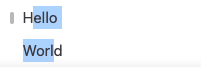
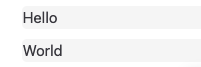

# Selection

Selection is a very common concept in structure editors. It's used for representing the current cursor position or the current selected blocks.

In BlockSuite, we use a data driven approach to represent the selection. It also follows the [CRDT-native data flow](./crdt-native-data-flow), which means the selection state is always derived from serializable data.

## Selection Model

The selection model contains a list of selections. Each selection is a range of the content. For example, if you have a text block with the following content:

> Hello
>
> World

In BlockSuite, it will be represented as following:

```
|-- Page Block (id: a)
    |-- Note Block (id: b)
        |-- Text Block (id: c)
        |-- Text Block (id: d)
```

And if you select the text partially via mouse drag as following:



The selection model will be:

```typescript
[
  {
    type: 'text',
    group: 'note',
    from: {
      path: ['a', 'b', 'c'],
      index: 1,
      length: 5,
    },
    to: {
      path: ['a', 'b', 'd'],
      index: 0,
      length: 4,
    },
  },
];
```

If you select the blocks via block selection like this:



The selection model will be:

```ts
[
  {
    type: 'block',
    group: 'note',
    path: ['a', 'b', 'c'],
  },
  {
    type: 'block',
    group: 'note',
    path: ['a', 'b', 'd'],
  },
];
```

## Type and Group

Selection model has two important properties: `type` and `group`.

The `type` of a selection means which kind of selection it is.
And the `group` of a selection means the selection's scope.

Some types of selections can share the same group because they have the same scope. For example, the `text` selection and the `block` selection can share the `note` group because they are both in the `note` block. And you may also have a `cell` and `row` selection in a `table` block, and they can share the `table` group.

## Read and Write Selection

You can get the selection manager from `std.selection`. With the manager, you can read the selection model from `value`. And you can also write the selection model by `set` and `update`.

```ts
const { selection } = std;

const current = selection.value;
const next = yourLogic(current);
selection.set(next);

// This can also be written as:
selection.update(current => yourLogic(current));
```

The `set` method will override all current selections.

You can create a new selection by using `selection.create` method.

```ts
const { selection } = std;

const blockSelection = selection.create('block', { path: [0, 1, 2] });
```

What if you want to pick some selections by `type` from the current selection model? We provide `pick` and `find` methods to help you.

```ts
const { selection } = std;

const textSelection: Selection = selection.pick('text');
const blockSelections: Selection[] = selection.find('block');
```

You can clear all the selections by call `clear`. If you just want to clear a type of selections, you can pass the type as the first argument of `clear` method.

```ts
const { selection } = std;

// clear all selections
selection.clear();

// clear text selection
selection.clear('text');
```

And we also provide a `setGroup` method to override the selections in a specific group. Of course, we also provide a `getGroup` method.

```ts
const { selection } = std;

const noteSelections = selection.getGroup('note');
const nextNoteSelections = yourLogic(noteSelections);
selection.setGroup('note', nextNoteSelections);
```

## Subscribe to Selection Changes

You can subscribe to the selection changes by using `changed` slot.

```ts
const { selection } = std;

selection.slots.changed.on(nextSelection => {
  renderSelectionToUI(nextSelection);
});
```

You can also subscribe to the remote selection changes by using `remoteChanged` slot. This is useful when you want to display the selection of other users.

```ts
const { selection } = std;

selection.slots.remoteChanged.on(nextSelectionMap => {
  for (const [userId, nextSelection] of nextSelectionMap) {
    renderRemoteSelectionToUI(nextSelection, userId);
  }
});
```

## Create Custom Selection

You can create your own selection type by extending the `BaseSelection` interface.

```ts
import { BaseSelection, PathFinder } from '@blocksuite/block-std';
import z from 'zod';

const MySelectionSchema = z.object({
  path: z.array(z.string()),
});

export class MySelection extends BaseSelection {
  static override type = 'mySelection';
  static override group = 'note';

  override equals(other: BaseSelection): boolean {
    if (other instanceof MySelection) {
      return PathFinder.equals(this.path, other.path);
    }
    return false;
  }

  override toJSON(): Record<string, unknown> {
    return {
      type: this.type,
      path: this.path,
    };
  }

  static override fromJSON(json: Record<string, unknown>): ImageSelection {
    MySelectionSchema.parse(json);
    return new MySelection({
      path: json.path as string[],
    });
  }
}

declare global {
  namespace BlockSuite {
    interface Selection {
      mySelection: typeof MySelection;
    }
  }
}
```

After that, you need to register the selection to selection manager:

```ts
const { selection } = std;

std.selection.register(MySelection);
```

Now you can use the `MySelection` in the selection model.

```ts
const mySelection = std.selection.create('mySelection', {
  path: ['a', 'b', 'c'],
});
```
