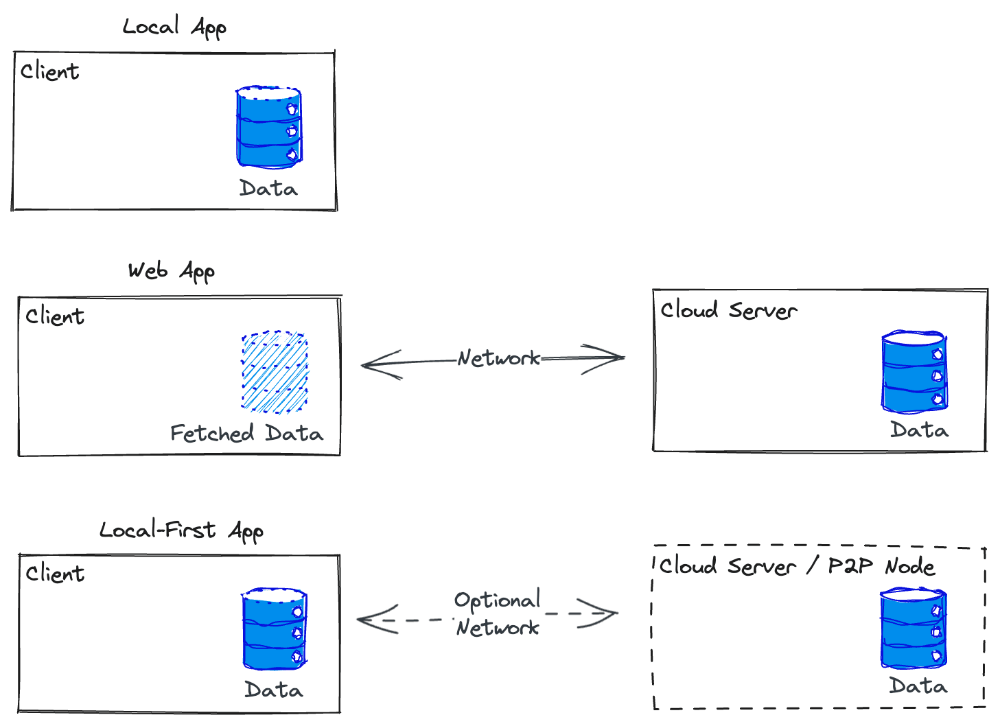
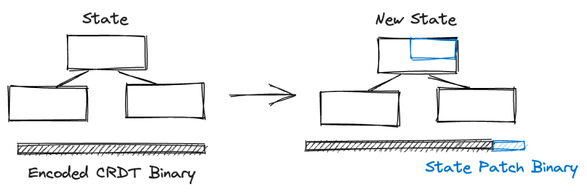
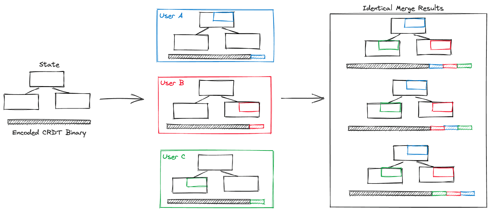

# The Local-First Paradigm

The BlockSuite framework serves as the foundation for the AFFiNE knowledge base, similar to how the Chromium engine powers the Chrome browser. However, BlockSuite is not only open-source independently, but also incorporates substantial foundational architectural designs to ensure its versatility. This decision stems from our belief that AFFiNE sets a benchmark for a new application architecture, while BlockSuite can serve as a general-purpose framework for building products based on this architecture. This architecture is known as _[local-first](https://www.inkandswitch.com/local-first/)_.

## What is Local-First?

Before the rise of web applications, the most classic form of application was the local application. Its functionality won't be affected by network latency, and it could quickly save content to local files, giving users full control over their data. However, when it comes to collaboration, conflicts could easily arise when different users made changes to their respective local files.

Later on, the widespread adoption of browsers brought web applications ubiquitous. These applications heavily relied on centralized server infrastructure to facilitate collaboration among multiple users. However, a notable drawback is their dependence on the internet connection, and their data is controlled by closed platforms.

In contrast, local-first applications provide both low-latency operations performed locally and comprehensive collaboration capabilities. This _allows_ (note that this is not mandatory) storing application data entirely on the local device, without the need for network connection for functioning. However, when connected to the internet, they seamlessly continue collaboration, offering a smooth experience that combines the advantages of local and web applications.



To achieve the ideal experience of local-first applications, a technological breakthrough is required, and that breakthrough is [CRDT](https://en.wikipedia.org/wiki/Conflict-free_replicated_data_type) (Conflict-free Replicated Data Type).

## Local-First and CRDTs

Why is CRDT crucial for local-first applications? Because its data model solves the conflict problem that arises during collaboration in local apps. CRDT provides data structures similar to the standard `Array` and `Map` in JavaScript, which can be used to model application state, like this:

```ts
// Yjs is the CRDT library used in BlockSuite
import * as Y from 'yjs';

const yMap = new Y.Map();
const yArray = new Y.Array();

yArray.push('hello');
yMap.set('world', yArray);
```

At first glance, this doesn't seem different from using standard JavaScript data structures. And just like arrays and objects in JavaScript can be serialized as JSON, CRDT states can also be serialized in a binary protocol similar to protobuf. But the key point is that any operation like `yArray.push` can be incrementally encoded in this format and distributed, similar to git patches.



Most importantly, the algorithm of CRDT guarantees that concurrent updates from multiple users, regardless of the order of merging, always result in a eventually consistent state, similar to git but never conflicts. For example, if three users A, B, and C each generate their own patch locally, **no matter the order in which all of their patches are merged, all users will obtain an eventually consistent state**. This merging of states happens independently on each user's device. Thus, we can eliminate the need for the server to be the authoritative source of truth.



## Local-First in AFFiNE

To help building local-first applications like AFFiNE, BlockSuite has fully utilized CRDT to construct its block tree. Based on this approach, **the content stored locally in AFFiNE is no longer directly using a human-readable file format, but in the binary format serialized from the CRDT block tree**. This enables AFFiNE to support some unique capabilities:

- The network becomes entirely optional, just like how git can be used without GitHub.
- Collaboration can take place without a server, as long as two clients establish a peer-to-peer connection.
- Knowledge base files exported in CRDT format always remain in a collaborative state, requiring only the merge of upcoming patches to continue collaboration.

These traits are particularly important for knowledge management applications like AFFiNE. However, even if you are developing an application that is not specifically a knowledge base, will the principles of local-first still make sense? We believe the answer is still affirmative.

## Local-First in Cloud-Based Applications

In the realm of server-based applications, developers can still harness the power of CRDT, the fundamental aspects in local-first applications, to easliy integrate powerful capabilities like real-time collaboration.

In addition to this, CRDT also offers the following benefits to application developers as a state management tool:

- **Out-of-the-box history tracking**: CRDT allows for simple traversal between historical states, similar to `git checkout`, without the need for complex state management primitives.
- **Incremental UI updates**: The data model of CRDT already provides the ability to diff like the virtual DOM, enabling a clear [one-way data flow](./unidirectional-data-flow) based on patches from state updates.
- **Pluggable data synchronization**: The synchronization of CRDT binary across different network protocols can be handled by [providers](./data-persistence#provider-based-persistence), eliminating the need for explicit network operations (such as sending HTTP requests) in the application logic. Simply connect to a provider, and the synchronization is taken care of!

By fully implementing its data layer with CRDT, BlockSuite not only provides real-time collaboration capabilities, but also comes with the advantages mentioned above, facilitating the development of collaborative applications.

If you are interested in learning how to use BlockSuite in server-based applications, please refer to the [Data Persistence](./data-persistence) section for more information.
