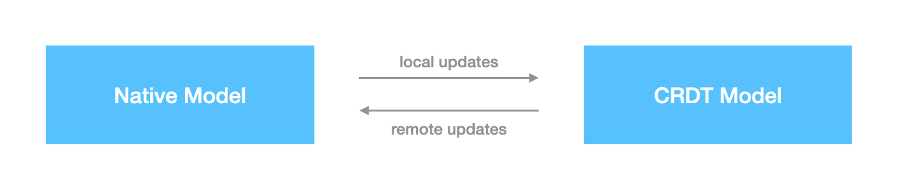

# Unidirectional Data Flow

Although `@blocksuite/editor` is an editor specifically designed for AFFiNE, the BlockSuite project is not solely designed to meet the needs of rich-text editing. Its vision is to become a universal infrastructure for collaborative applications. This means:

1. Regardless of whether you build an editor or a regular web application based on BlockSuite, they should operate data in a consistent manner.
2. Regardless of whether it is in a multi-user collaboration state, the application-layer code based on BlockSuite should be unaware of it.

Next, we will introduce how this design concept is embodied in `@blocksuite/editor`.

## CRDT as Single Source of Truth

Traditionally, CRDTs have often been seen as a technology specialized in conflict resolution. Many editors initially designed to support single users have implemented support for real-time collaboration by integrating CRDT libraries. To this end, the data models in these editors will be synchronized to the CRDTs. This usually involves two opposite data flows:

- When the local model is updated, the state of the native model is synchronized to the CRDT model.
- When a remote peer is updated, the data resolved from the CRDT model is synchronized back to the native model.



Although this is an intuitive and common practice, it requires synchronization between two heterogeneous models, resulting in a bidirectional data flow. The main issues here are:

- This bidirectional binding is not that easy to implement reliably and requires non-trivial modifications.
- Application-layer code often needs to distinguish whether an update comes from a remote source, which increases complexity.

As an alternative, BlockSuite chooses to directly use the CRDT model as the single source of truth (since BlockSuite uses [Yjs](https://github.com/yjs/yjs), we also call it _YModel_ here). This means that regardless of whether the update comes from local or remote sources, the same process will be performed:

1. Firstly modify YModel, triggering the corresponding [`Y.Event`](https://docs.yjs.dev/api/y.event) that contains all incremental state changes in this update.
2. Update the model nodes in the block tree based on the `Y.Event`.
3. Send corresponding slot events after updating the block model, so as to update UI components accordingly.

This design can be represented by the following diagram:


The advantage of this approach is that the application-layer code can **completely ignore whether updates to the block model come from local editing, history stack, or collaboration with other users**. Just subscribing to model update events is adequate.

::: info
In BlockSuite, we generally refer to the block instances that users manipulate through the page API as _block models_, but the true source of the state of these models comes from their underlying CRDT data structure, which is usually referred to as _YBlock_ in our documentation.
:::

## Case Study

As an example, suppose the current block tree structure is as follows:

```
PageBlock
  FrameBlock
    ParagraphBlock 0
    ParagraphBlock 1
    ParagraphBlock 2
```

Now user A selects `ParagraphBlock 2` and presses the delete key to delete it. At this point, `page.deleteBlock` should be called to delete this block model instance:

```ts
const blockModel = page.root.children[0].children[2];
page.deleteBlock(blockModel);
```

At this point, BlockSuite will not directly modify the block tree under `page.root`, but will instead firstly modifies the underlying YBlock. After the CRDT state is changed, Yjs will generate the corresponding `Y.Event` data structure, which contains all the incremental state changes in this update. BlockSuite will always use this as the basis to synchronize the block models, then trigger the corresponding slot events for UI updates.

In this example, as the parent of `ParagraphBlock 2`, the `model.childrenUpdated` slot event of `FrameBlock` will be triggered. This will enable the corresponding component in the UI framework component tree to refresh itself. Since each child block has an ID, this is very conducive to combining the common list key optimizations in UI frameworks, achieving on-demand block component updates.

But the real power lies in the fact that if this block tree is being concurrently edited by multiple people, when user B performs a similar operation, the corresponding update will be encoded by Yjs and distributed by the provider. When User A receives and applies the update from User B, the same state update pipeline as local editing will be triggered. **This makes it unnecessary for the application to make any additional modifications or adaptations for collaboration scenarios, inherently gaining real-time collaboration capabilities**.

## Summary

In summary, by utilizing the CRDT model as the single source of truth, the application layer code can remain agnostic to whether updates originate from local or remote sources. This simplifies synchronization and reduces complexity. This approach enables applications to acquire real-time collaboration capabilities without necessitating intrusive modifications or adaptations, which is a key reason why the BlockSuite editor has been inherently collaborative from day one.
