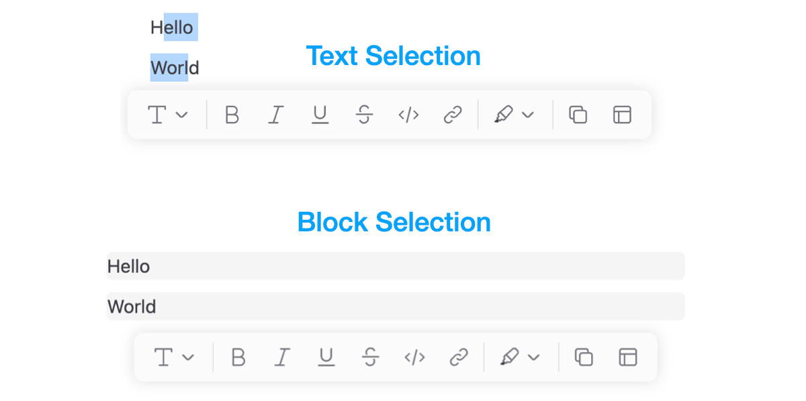
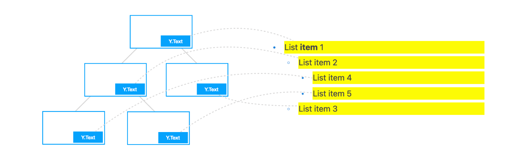

# Working with Block Tree

In previous examples, we demonstrated how a `page` collaborates with an `editor`. In this document, we will introduce the basic structure of the block tree within the `page` and the common methods for controlling it in an editor environment.

## Block Tree Basics

In BlockSuite, each `page` object manages an independent block tree composed of various types of blocks. These blocks can be defined through the [`BlockSchema`](./block-schema.md), which specifies their fields and permissible nesting relationships among different block types. Each block type has a unique `block.flavour`, following a `namespace:name` naming structure. Since the preset editors in BlockSuite are derived from the [AFFiNE](https://github.com/toeverything/AFFiNE) project, the default editable blocks use the `affine` prefix.

To manipulate blocks, you can utilize several primary APIs under `page`:

- [`page.addBlock`](/api/@blocksuite/store/classes/Page.html#addblock)
- [`page.updateBlock`](/api/@blocksuite/store/classes/Page.html#updateblock)
- [`page.deleteBlock`](/api/@blocksuite/store/classes/Page.html#deleteblock)
- [`page.getBlockById`](/api/@blocksuite/store/classes/Page.html#getblockbyid)

Here is an example demonstrating the manipulation of the block tree through these APIs:

```ts
// The first block will be added as root
const rootId = page.addBlock('affine:page');

// Insert second block as a child of the root with empty props
const noteId = page.addBlock('affine:note', {}, rootId);

// You can also provide an optional `parentIndex`
const paragraphId = page.addBlock('affine:paragraph', {}, noteId, 0);

const modelA = page.root!.children[0].children[0];
const modelB = page.getBlockById(paragraphId);
console.log(modelA === modelB); // true

// Update the paragraph type to 'h1'
page.updateBlock(modelA, { type: 'h1' });

page.deleteBlock(modelA);
```

This example creates a subset of the block tree hierarchy defaultly used in `@blocksuite/presets`, illustrated as follows:


As a document-centric framework, **you need to initialize a valid document structure before attaching it to editors**, which is also why it requires `init()` after `createEmptyPage()`. See [creating new block tree](./data-persistence#creating-new-block-tree) for more details.

::: info
The block tree hierarchy is specific to the preset editors. At the framework level, `@blocksuite/store` does **NOT** treat the "first-party" `affine:*` blocks with any special way. Feel free to add blocks from different namespaces for the block tree!
:::

All block operations on `page` are automatically recorded and can be reversed using [`page.undo()`](/api/@blocksuite/store/classes/Page.html#undo) and [`page.redo()`](/api/@blocksuite/store/classes/Page.html#redo). By default, operations within a certain period are automatically merged into a single record. However, you can explicitly add a history record during operations by inserting [`page.captureSync()`](/api/@blocksuite/store/classes/Page.html#capturesync) between block operations:

```ts
const rootId = page.addBlock('affine:page');
const noteId = page.addBlock('affine:note', {}, rootId);

// Capture a history record now
page.captureSync();

// ...
```

This is particularly useful when adding multiple blocks at once but wishing to undo them individually.

## Block Tree in Editor

To understand the common operations on the block tree in an editor environment, it's helpful to grasp the basic design of the editor. This can start with the following code snippet:

```ts
const { host } = editor;
const { spec, selection, command } = host.std;
```

Firstly, let's explain the newly introduced `host` and `std`, which are determined by the framework-agnostic architecture of BlockSuite:

- As [mentioned before](./component-types#composing-editors-by-blocks), the `editor.host` - also known as the [`EditorHost`](/api/@blocksuite/lit/) component, is a container for mounting block UI components. It handles the heavy lifting involved in mapping the **block tree** to the **component tree**.
- Regardless of the framework used to implement `EditorHost`, they can access the same headless standard library designed for editable blocks through `host.std`. For example, `std.spec` contains all the registered [`BlockSpec`](./block-spec)s.

::: tip

- To access `host` after attaching page to an editor, wait for the [`page.slots.ready`](/api/@blocksuite/store/classes/Page.html#ready-1) slot.
- We usually access `host.spec` instead of `host.std.spec` to simplify the code.

:::

As the runtime for the block tree, this is the mental model inside the `editor`:


## Selecting Blocks

The essence of editor lies in allowing users to **dynamically select and modify** the data. In BlockSuite, you can use the `SelectionManager`, which is responsible for managing selections, through `std.selection` or `host.selection`. As an example, after selecting some blocks in the editor, you can execute the following code snippets line by line in the console:

```ts
// Get current selection state
const cached = selection.value;

// Clear current selection state
selection.clear();

// Recover the selection state from cache
selection.set(cached);

// Try setting only part of the selection
selection.set([cached[0]]);
```

In `block-std`, BlockSuite implements several atomic selection types for `SelectionManager`, such as `TextSelection` and `BlockSelection`. The content currently selected by the user is automatically divided into these primitive selection data structures, recorded in the list returned by `selection.value`. Through `selection.set()`, you can also programmatically control the current selection state of the editor.

This allows the selection manager to handle different types of selections, as shown in the following illustration, using the same API:



In `selection.value`, different types of selection states can coexist simultaneously. Each selection object records at least the `id` and `path` of the corresponding selected block (i.e., the sequence of ids of all blocks from the root block to that block). Moreover, you can further categorize different types of selections using the `group` field. For example in `DocEditor`, both `TextSelection` and `BlockSelection` belong to the `note` group. Hence, the example structure of block selection in the above image is as follows:

```ts
[
  {
    type: 'block',
    group: 'note',
    path: ['page_id', 'note_id', 'paragraph_1_id'],
  },
  {
    type: 'block',
    group: 'note',
    path: ['page_id', 'note_id', 'paragraph_2_id'],
  },
];
```

For the more complex native [selection](https://developer.mozilla.org/en-US/docs/Web/API/Selection), the `TextSelection` can be used to model it. It marks the start and end positions of the native selection in the block through the `from` and `to` fields, recording only the `index` and `length` of the inline text sequence in the respective block. This simplification is made possible by the architecture of BlockSuite, where editable blocks use `@blocksuite/inline` as the rich text editing component. Each block tree node's rich text content is rendered independently into different inline editors, eliminating nesting between rich text instances:



Additionally, the entire `selection.value` object is isolated under the `clientId` scope of the current session. During collaborative editing, selection instances between different clients will be distributed in real-time (via [providers](./data-persistence#provider-based-persistence)), facilitating the implementation of UI states like remote cursors.

For more advanced usage and details, please refer to the [`Selection`](./selection) documentation.

## Services and Commands

TODO

## Customizing Blocks

TODO
