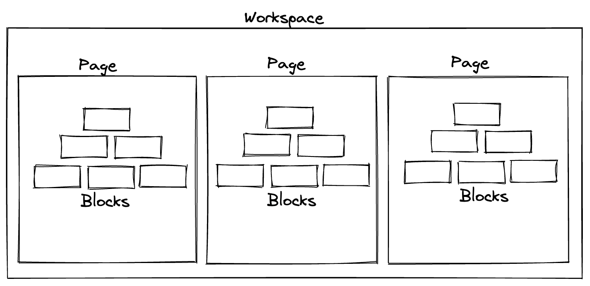

# Workspaces and Pages

BlockSuite is centered around the concept of blocks. However, to handle a large number of blocks efficiently, the blocks are organized into workspaces and pages. `Workspace` is the highest-level container that can hold multiple pages. `Page` is the sub-container for organizing blocks, and each page contains a strongly typed block tree.



## Workspaces

A `workspace` in BlockSuite acts as a top-level container for organizing pages. By creating workspaces, users can group and categorize different sets of pages, each representing a specific project or a collection of related content. Here is how we create a new workspace:

```ts
import { Workspace, Schema } from '@blocksuite/store';
import { AffineSchemas } from '@blocksuite/blocks/models';

const schema = new Schema().register(AffineSchemas);
const workspace = new Workspace({ schema });
```

::: info
The concept of `schema` here relates to the block definitions used in the workspace. See [block schema](./block-schema) for further information.
:::

## Pages

A `page` in BlockSuite serves as the actual container for organizing blocks, allowing users to operate on the block tree through its APIs. By taking the advantage of [subdocuments](https://docs.yjs.dev/api/subdocuments), the page content can also be loaded asynchronously on-demand. In typical scenarios involving rich text documents, one document is represented by a single page within a workspace.

Here is how we create a new page with id `page0` within the workspace:

```ts
const page = workspace.createPage();
```

The `page` instance provides a set of core APIs for performing block operations, e.g., `page.addBlock`, `page.updateBlock`, and `page.deleteBlock`. These APIs will be further introduced in the following sections of the document.

To init basic block content in a `page`, simply wrap the initial block operation APIs inside `page.load()`:

```ts
const page = workspace.createPage();

page.load(() => {
  page.addBlock('affine:page', {});
  // ...
});
```
